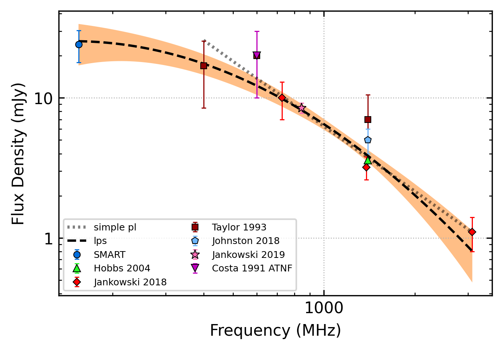

.. _J1146-6030:
J1146-6030
==========

Best Fit
--------

.. csv-table:: J1146-6030 fit results
   :header: "model","a","b","c","v0 (MHz)"

   "log_parabolic_spectrum","-0.86±0.36","-1.15±0.16","-1.98±0.05","691±6"

Fit Before MWA
--------------

.. csv-table:: J1146-6030 before fit results
   :header: "model","a","c","v0 (MHz)"

   "simple_power_law","-1.54±0.21","0.01±0.00","1113±11"

Flux Density Results
--------------------
.. csv-table:: J1146-6030 flux density total results
   :header: "N obs", "Flux Density (mJy)", "u_S_mean", "u_scint", "m_r_v"

   "1",  "24.1±9.1", "6.1", "6.7", "0.276"

.. csv-table:: J1146-6030 flux density individual results
   :header: "ObsID", "Flux Density (mJy)"

    "1267459328", "24.1±6.1"

Comparison Fit
--------------
.. image:: comparison_fits/J1146-6030_comparison_fit.png
  :width: 800

Detection Plots
---------------

.. image:: detection_plots/1267459328_J1146-6030.prepfold.png
  :width: 800

.. image:: on_pulse_plots/1267459328_J1146-6030_128_bins_gaussian_components.png
  :width: 800