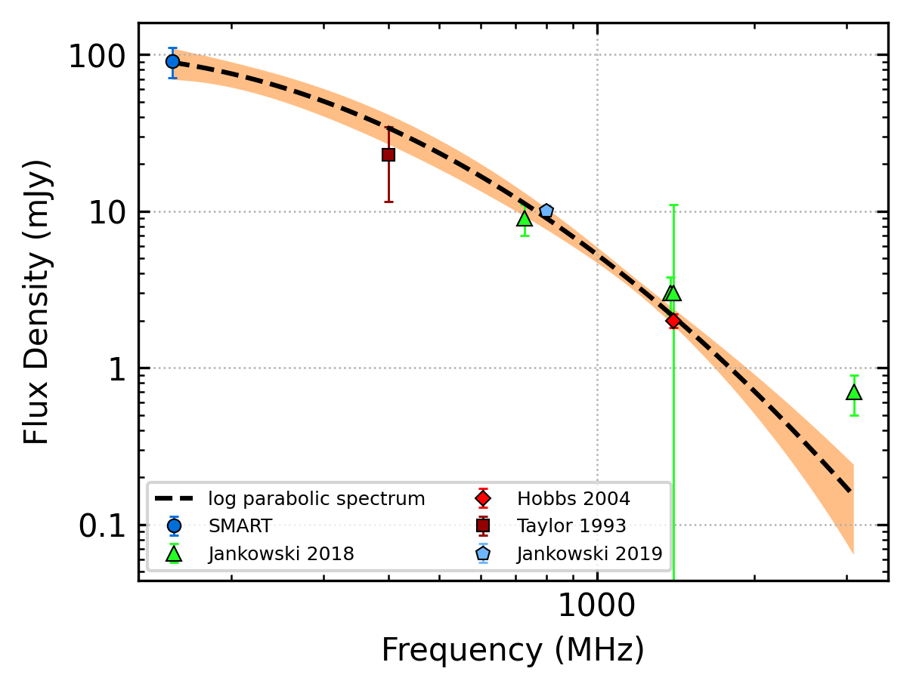
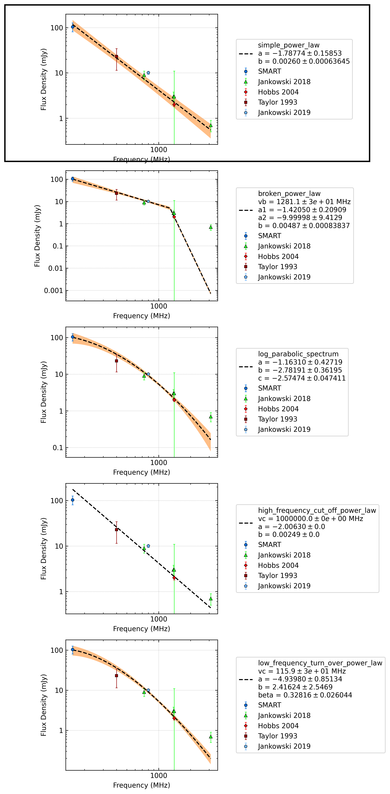
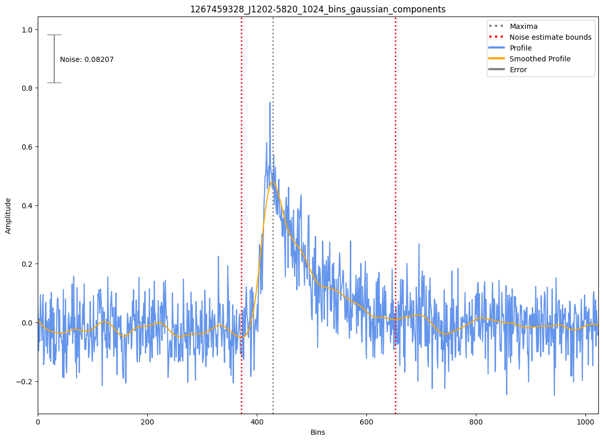
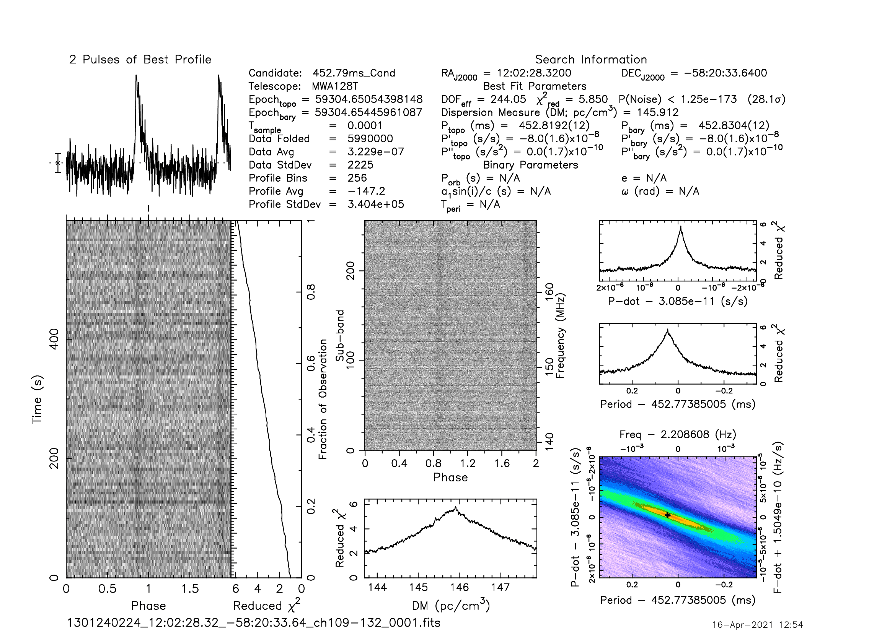
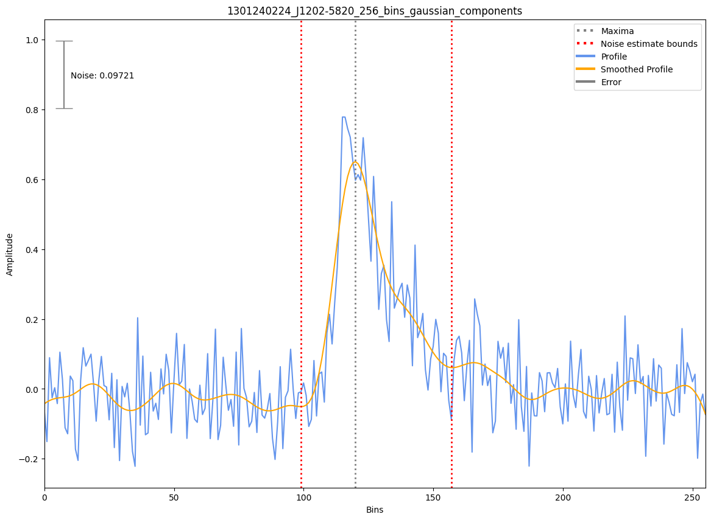

J1202-5820
==========

Best Fit
--------

.. csv-table:: J1202-5820 fit results
   :header: "model","a","b","c"

   "log_parabolic_spectrum","-1.25±0.49","-2.81±0.44","-2.58±0.05"

Fit Before MWA
--------------
.. image:: before_mwa/J1202-5820_simple_power_law_fit.png
  :width: 800

.. csv-table:: J1202-5820 before fit results
   :header: "model","a","b"

   "simple_power_law","-2.21±0.33","0.00±0.00"

Flux Density Results
--------------------
.. csv-table:: J1202-5820 flux density total results
   :header: "N obs", "Flux Density (mJy)", "u_S_mean", "u_scint", "m_r_v"

   "2",  "90.8±20.0", "11.8", "22.2", "0.244"

.. csv-table:: J1202-5820 flux density individual results
   :header: "ObsID", "Flux Density (mJy)"

    "1267459328", "103.3±7.0"
    "1301240224", "78.4±9.5"

Comparison Fit
--------------

Detection Plots
---------------

.. image:: detection_plots/1267459328_J1202-5820.prepfold.png
  :width: 800

