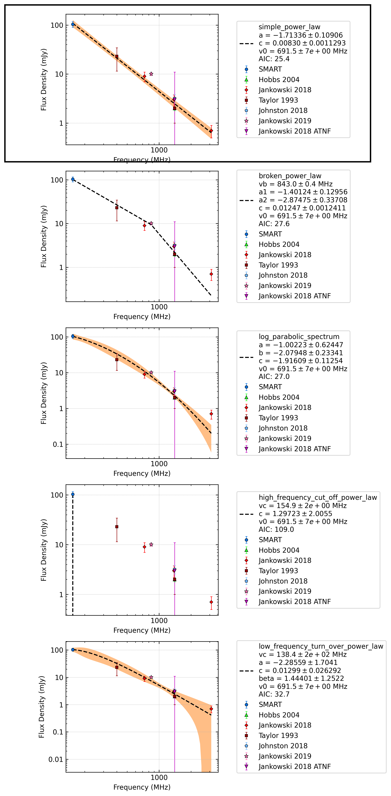

.. _J1202-5820:
J1202-5820
==========

Best Fit
--------
.. image:: best_fits/J1202-5820_i_fit.png
  :width: 800

.. csv-table:: J1202-5820 fit results
   :header: "model","a","b","v0 (MHz)"

   "i","-1.79±0.16","0.01±0.00","691±6"

Fit Before MWA
--------------

.. csv-table:: J1202-5820 before fit results
   :header: "model","a","b","v0 (MHz)"

   "i","-2.22±0.31","0.00±0.00","1113±11"

Flux Density Results
--------------------
.. csv-table:: J1202-5820 flux density total results
   :header: "N obs", "Flux Density (mJy)", "u_S_mean", "u_scint", "m_r_v"

   "2",  "103.8±23.1", "13.4", "25.3", "0.244"

.. csv-table:: J1202-5820 flux density individual results
   :header: "ObsID", "Flux Density (mJy)"

    "1267459328", "119.3±8.1"
    "1301240224", "88.4±10.7"

Comparison Fit
--------------

Detection Plots
---------------

.. image:: detection_plots/1267459328_J1202-5820.prepfold.png
  :width: 800

.. image:: on_pulse_plots/1267459328_J1202-5820_1024_bins_gaussian_components.png
  :width: 800

.. image:: on_pulse_plots/1301240224_J1202-5820_256_bins_gaussian_components.png
  :width: 800