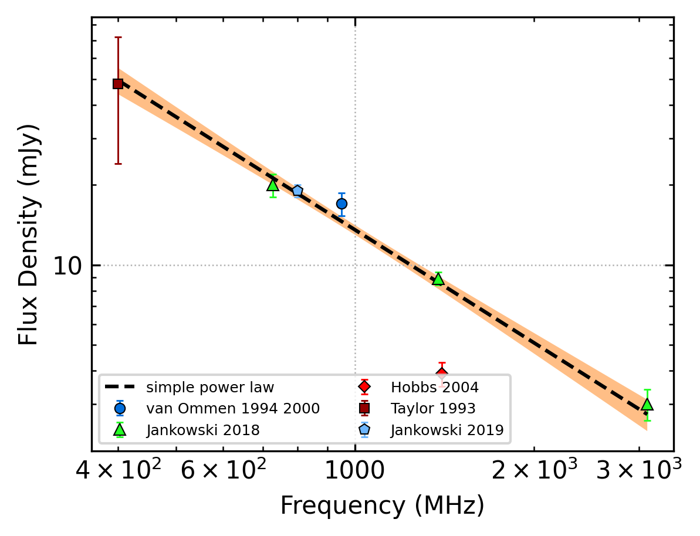
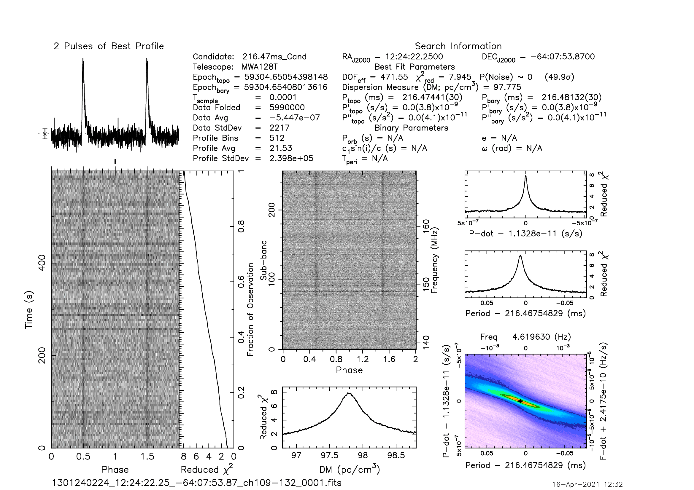
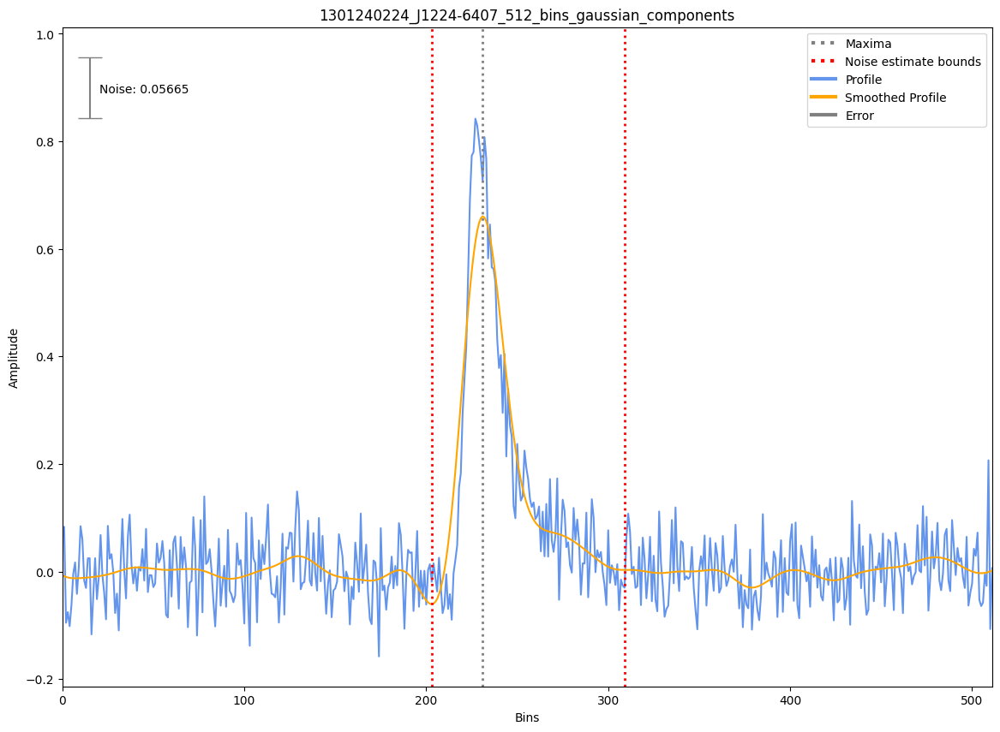

J1224-6407
==========

Best Fit
--------
.. image:: best_fits/J1224-6407_log_parabolic_spectrum_fit.png
  :width: 800

.. csv-table:: J1224-6407 fit results
   :header: "model","a","b","c"

   "log_parabolic_spectrum","-0.55±0.26","-1.45±0.19","-2.02±0.02"

Fit Before MWA
--------------

.. csv-table:: J1224-6407 before fit results
   :header: "model","a","b"

   "simple_power_law","-1.41±0.11","0.01±0.00"

Flux Density Results
--------------------
.. csv-table:: J1224-6407 flux density total results
   :header: "N obs", "Flux Density (mJy)", " u_S_mean", "u_scint", "m_r_v"

   "2",  "62.9±18.7", "10.3", "18.5", "0.294"

.. csv-table:: J1224-6407 flux density individual results
   :header: "ObsID", "Flux Density (mJy)"

    "1267459328", "47.0±6.1"
    "1301240224", "78.9±8.3"

Comparison Fit
--------------
.. image:: comparison_fits/J1224-6407_comparison_fit.png
  :width: 800

Detection Plots
---------------

.. image:: detection_plots/1267459328_J1224-6407.prepfold.png
  :width: 800

.. image:: on_pulse_plots/1267459328_J1224-6407_512_bins_gaussian_components.png
  :width: 800

