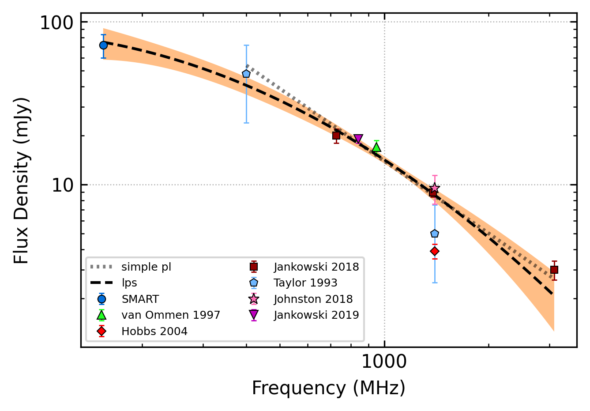
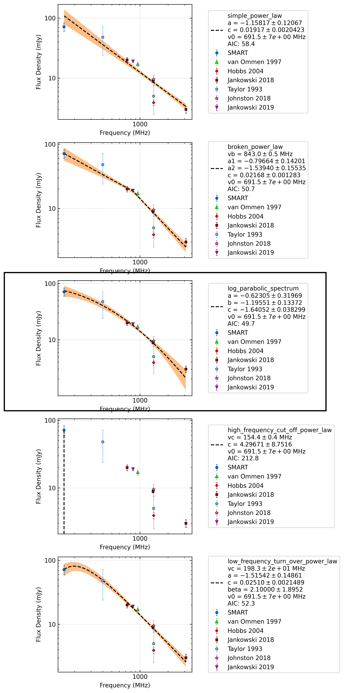
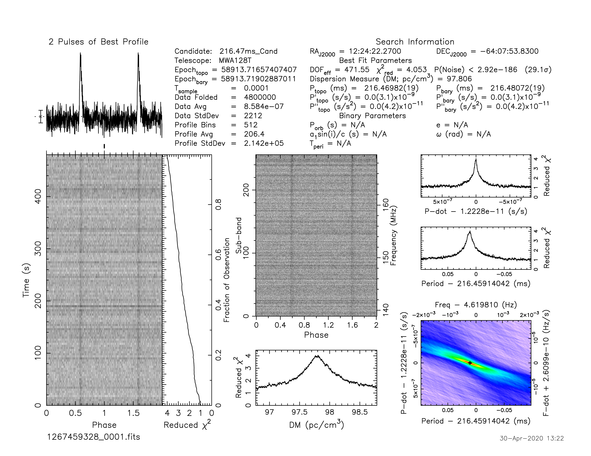

.. _J1224-6407:
J1224-6407
==========

Best Fit
--------

.. csv-table:: J1224-6407 fit results
   :header: "model","a","b","c","v0 (MHz)"

   "log_parabolic_spectrum","-0.42±0.22","-1.17±0.11","-1.66±0.03","691±6"

Fit Before MWA
--------------

.. csv-table:: J1224-6407 before fit results
   :header: "model","a","b","v0 (MHz)"

   "simple_power_law","-1.42±0.13","0.01±0.00","1113±11"

Flux Density Results
--------------------
.. csv-table:: J1224-6407 flux density total results
   :header: "N obs", "Flux Density (mJy)", "u_S_mean", "u_scint", "m_r_v"

   "2",  "71.6±21.0", "11.8", "21.1", "0.294"

.. csv-table:: J1224-6407 flux density individual results
   :header: "ObsID", "Flux Density (mJy)"

    "1267459328", "54.3±7.1"
    "1301240224", "89.0±9.4"

Comparison Fit
--------------

Detection Plots
---------------

.. image:: on_pulse_plots/1267459328_J1224-6407_512_bins_gaussian_components.png
  :width: 800
.. image:: detection_plots/pf_1301240224_J1224-6407_12:24:22.25_-64:07:53.87_b512_216.47ms_Cand.pfd.png
  :width: 800

.. image:: on_pulse_plots/1301240224_J1224-6407_512_bins_gaussian_components.png
  :width: 800