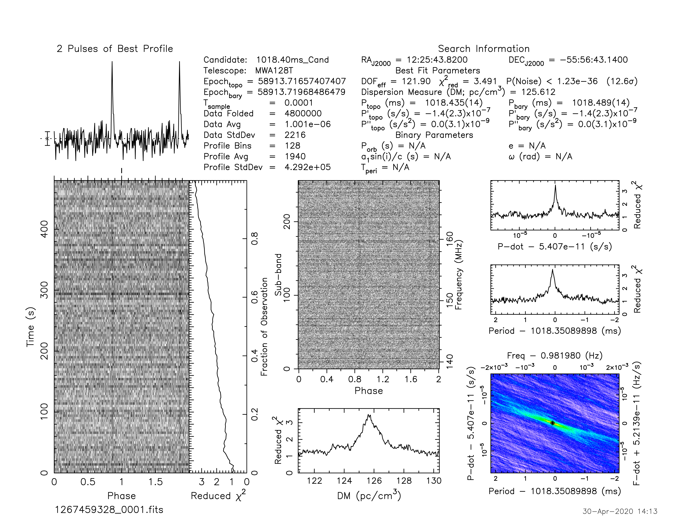

J1225-5556
==========

Flux Density Results
--------------------
.. csv-table:: J1225-5556 flux density total results
   :header: "N obs", "Flux Density (mJy)", " u_S_mean", "u_scint", "m_r_v"

   "1",  "12.8±5.9", "4.8", "3.3", "0.261"

.. csv-table:: J1225-5556 flux density individual results
   :header: "ObsID", "Flux Density (mJy)"

    "1267459328", "12.8±4.8"

Comparison Fit
--------------
.. image:: comparison_fits/J1225-5556_comparison_fit.png
  :width: 800

Detection Plots
---------------

.. image:: on_pulse_plots/1267459328_J1225-5556_128_bins_gaussian_components.png
  :width: 800