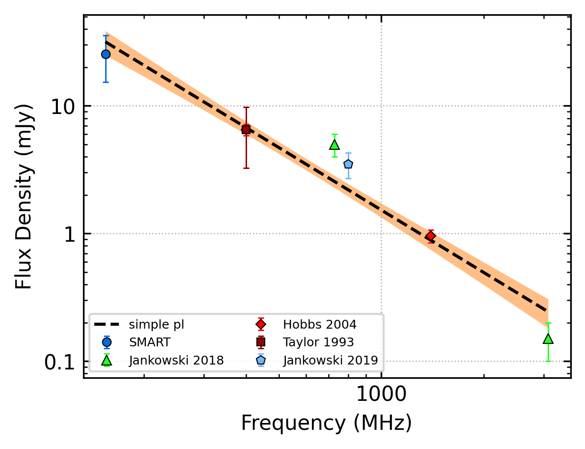
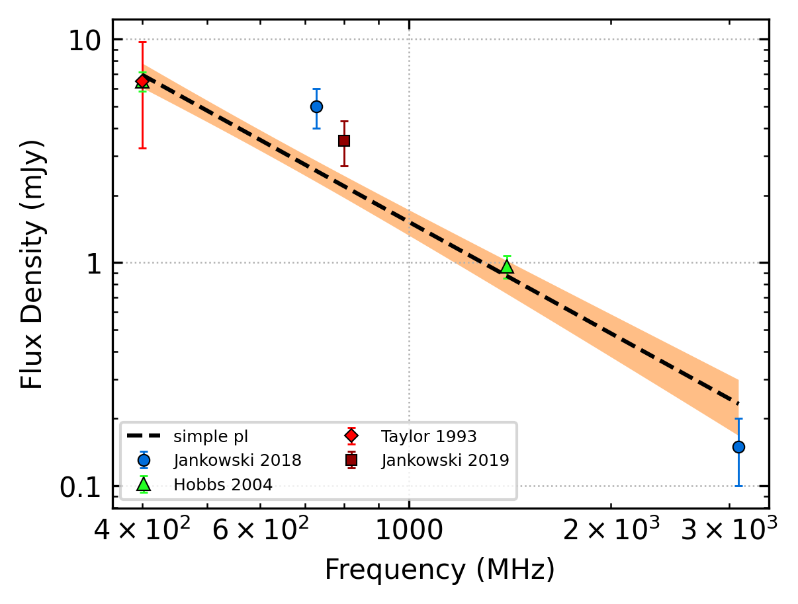
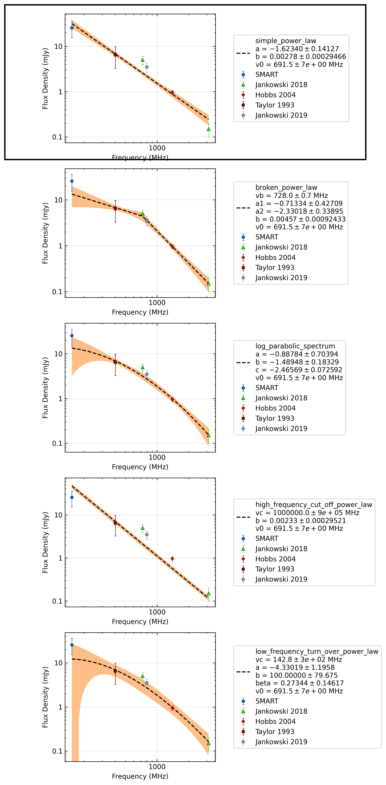
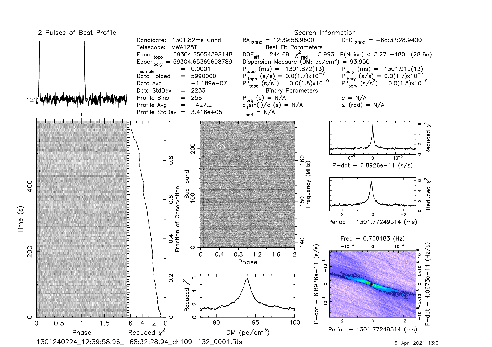
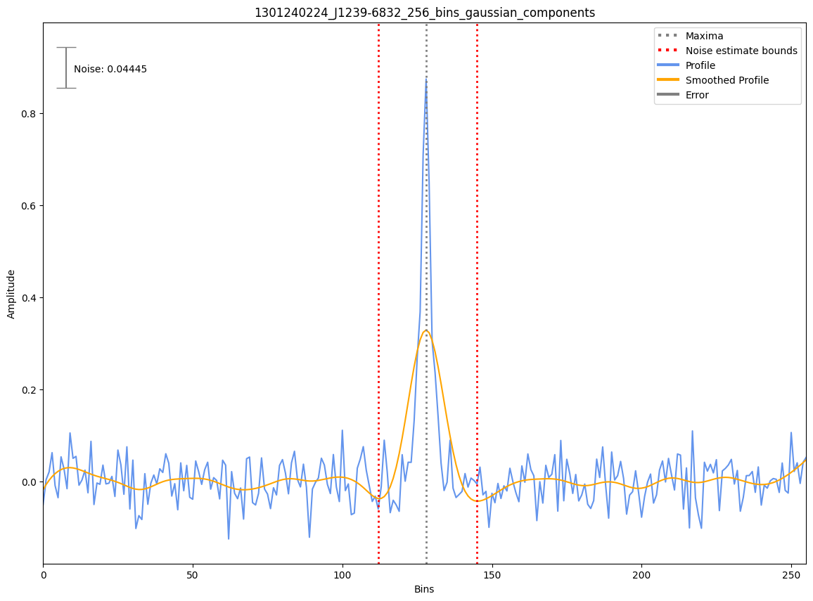

.. _J1239-6832:
J1239-6832
==========

Best Fit
--------

.. csv-table:: J1239-6832 fit results
   :header: "model","a","b","v0 (MHz)"

   "simple_power_law","-1.62±0.14","0.00±0.00","691±6"

Fit Before MWA
--------------

.. csv-table:: J1239-6832 before fit results
   :header: "model","a","b","v0 (MHz)"

   "simple_power_law","-1.66±0.16","0.00±0.00","1113±11"

Flux Density Results
--------------------
.. csv-table:: J1239-6832 flux density total results
   :header: "N obs", "Flux Density (mJy)", "u_S_mean", "u_scint", "m_r_v"

   "1",  "25.5±10.2", "6.7", "7.6", "0.299"

.. csv-table:: J1239-6832 flux density individual results
   :header: "ObsID", "Flux Density (mJy)"

    "1301240224", "25.5±6.7"

Comparison Fit
--------------

Detection Plots
---------------

