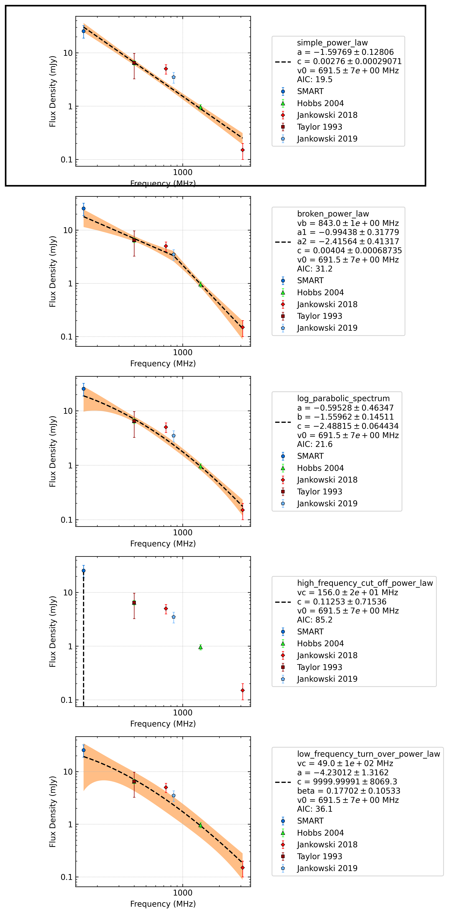

J1239-6832
==========

Best Fit
--------
.. image:: best_fits/J1239-6832_simple_power_law_fit.png
  :width: 800

.. csv-table:: J1239-6832 fit results
   :header: "model","a","b"

   "simple_power_law","-1.58±0.11","0.00±0.00"

Fit Before MWA
--------------
.. image:: before_mwa/J1239-6832_simple_power_law_fit.png
  :width: 800

.. csv-table:: J1239-6832 before fit results
   :header: "model","a","b"

   "simple_power_law","-1.63±0.13","0.00±0.00"

Flux Density Results
--------------------
.. csv-table:: J1239-6832 flux density total results
   :header: "N obs", "Flux Density (mJy)", "u_S_mean", "u_scint", "m_r_v"

   "1",  "22.6±9.0", "5.9", "6.8", "0.299"

.. csv-table:: J1239-6832 flux density individual results
   :header: "ObsID", "Flux Density (mJy)"

    "1301240224", "22.6±5.9"

Comparison Fit
--------------

Detection Plots
---------------

.. image:: on_pulse_plots/1301240224_J1239-6832_256_bins_gaussian_components.png
  :width: 800