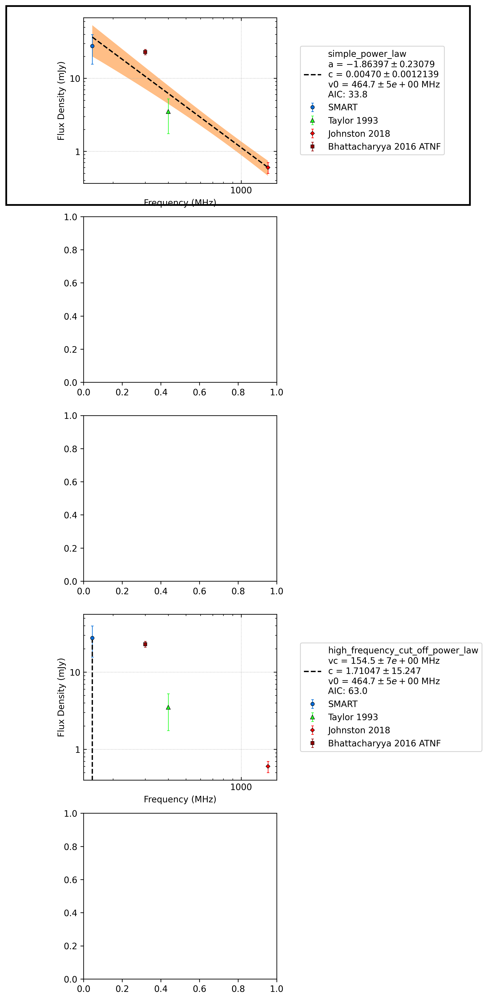

.. _J1240-4124:
J1240-4124
==========

Best Fit
--------
.. image:: best_fits/J1240-4124_simple_power_law_fit.png
  :width: 800

.. csv-table:: J1240-4124 fit results
   :header: "model","a","b","v0 (MHz)"

   "simple_power_law","-1.91±0.25","0.00±0.00","464±4"

Flux Density Results
--------------------
.. csv-table:: J1240-4124 flux density total results
   :header: "N obs", "Flux Density (mJy)", "u_S_mean", "u_scint", "m_r_v"

   "2",  "27.7±14.8", "12.1", "11.8", "0.427"

.. csv-table:: J1240-4124 flux density individual results
   :header: "ObsID", "Flux Density (mJy)"

    "1267459328", "21.2±7.8"
    "1301412552", "34.2±9.2"

Comparison Fit
--------------

Detection Plots
---------------

.. image:: detection_plots/1267459328_J1240-4124.prepfold.png
  :width: 800

.. image:: on_pulse_plots/1267459328_J1240-4124_256_bins_gaussian_components.png
  :width: 800
.. image:: detection_plots/pf_1301412552_J1240-4124_12:40:17.61_-41:24:51.70_b256_512.22ms_Cand.pfd.png
  :width: 800

.. image:: on_pulse_plots/1301412552_J1240-4124_256_bins_gaussian_components.png
  :width: 800