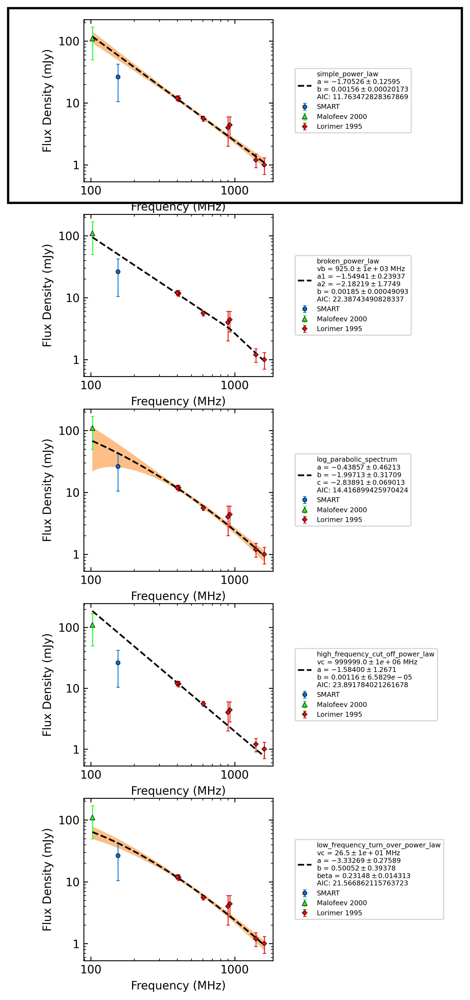
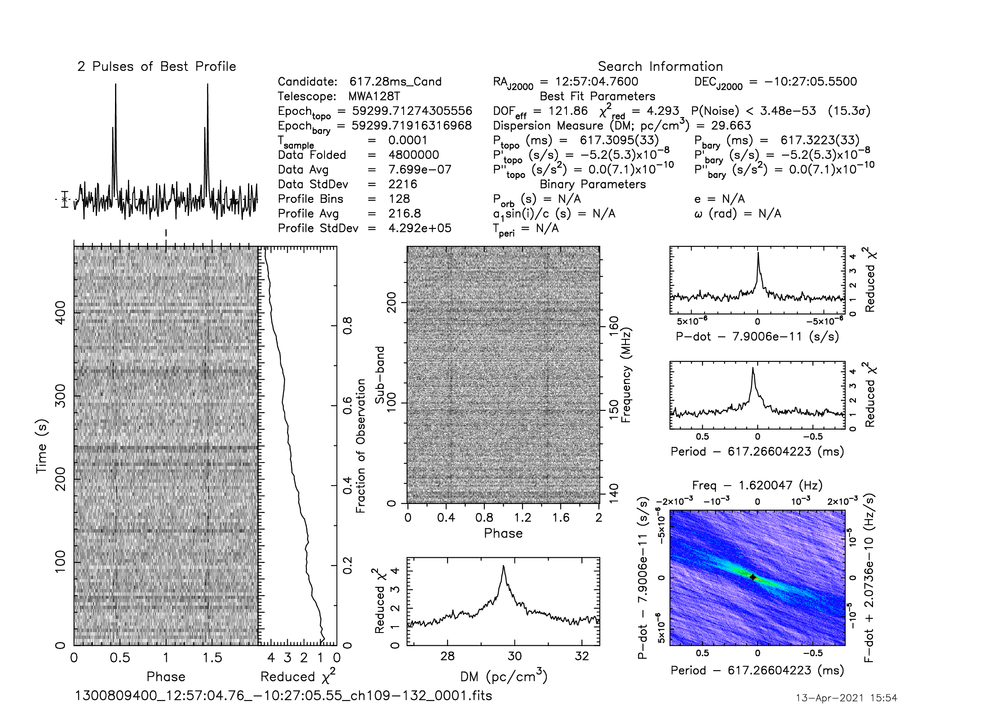
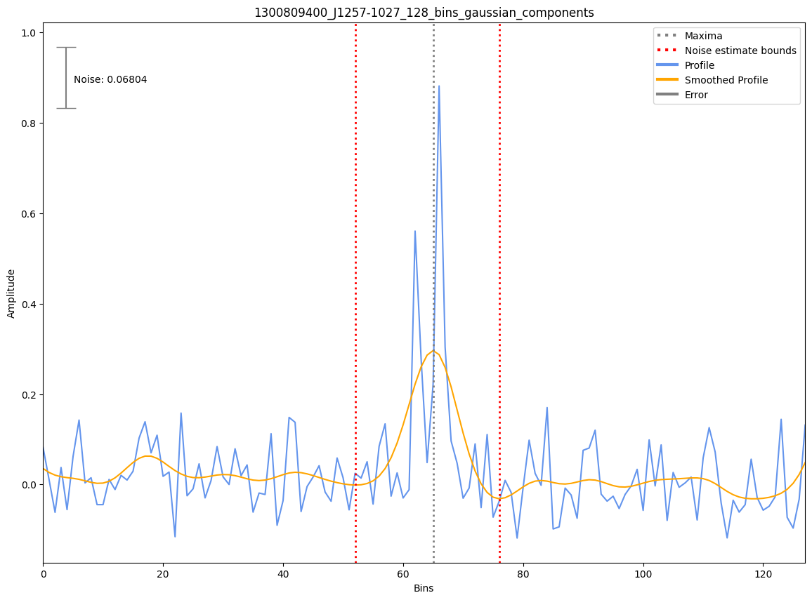

.. _J1257-1027:
J1257-1027
==========

Best Fit
--------
.. image:: best_fits/J1257-1027_fit.png
  :width: 800

.. csv-table:: J1257-1027 fit results
   :header: "model","a","c","v0 (MHz)"

   "simple_power_law","-1.50±0.20","0.01±0.00","405±4"

Fit Before MWA
--------------

.. csv-table:: J1257-1027 before fit results
   :header: "model","a","c","v0 (MHz)"

   "simple_power_law","-1.56±0.24","0.01±0.00","405±4"

Flux Density Results
--------------------
.. csv-table:: J1257-1027 flux density total results
   :header: "N obs", "Flux Density (mJy)", "u_S_mean", "u_scint", "m_r_v"

   "1",  "29.2±17.6", "9.2", "15.1", "0.515"

.. csv-table:: J1257-1027 flux density individual results
   :header: "ObsID", "Flux Density (mJy)"

    "1300809400", "29.2±9.2"

Comparison Fit
--------------

Detection Plots
---------------

