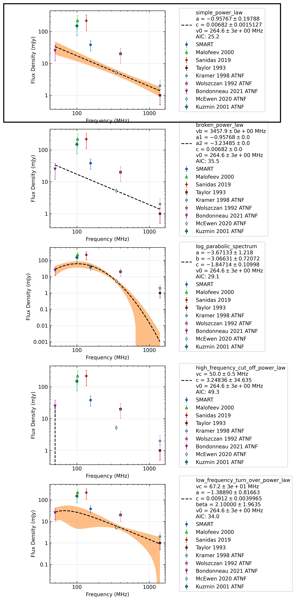
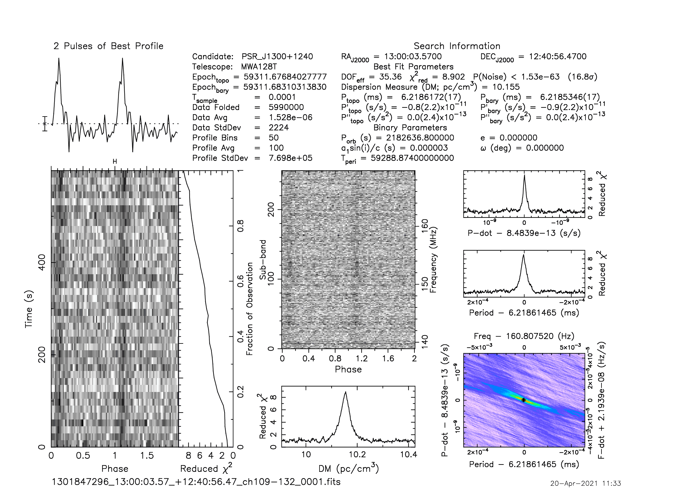

J1300+1240
==========

Best Fit
--------
.. image:: best_fits/J1300+1240_simple_power_law_fit.png
  :width: 800

.. csv-table:: J1300+1240 fit results
   :header: "model","a","b"

   "simple_power_law","-2.72±0.37","0.00±0.00"

Fit Before MWA
--------------
.. image:: before_mwa/J1300+1240_simple_power_law_fit.png
  :width: 800

.. csv-table:: J1300+1240 before fit results
   :header: "model","a","b"

   "simple_power_law","-0.77±0.46","0.00±0.00"

Flux Density Results
--------------------
.. csv-table:: J1300+1240 flux density total results
   :header: "N obs", "Flux Density (mJy)", " u_S_mean", "u_scint", "m_r_v"

   "2",  "34.8±22.6", "12.2", "29.6", "0.852"

.. csv-table:: J1300+1240 flux density individual results
   :header: "ObsID", "Flux Density (mJy)"

    "1300981728", "39.2±9.3"
    "1301847296", "30.4±7.9"

Comparison Fit
--------------

Detection Plots
---------------

.. image:: detection_plots/pf_1300981728_J1300+1240_13:00:03.57_+12:40:56.47_b50_PSR_J1300+1240.pfd.png
  :width: 800

.. image:: on_pulse_plots/
  :width: 800

.. image:: on_pulse_plots/
  :width: 800