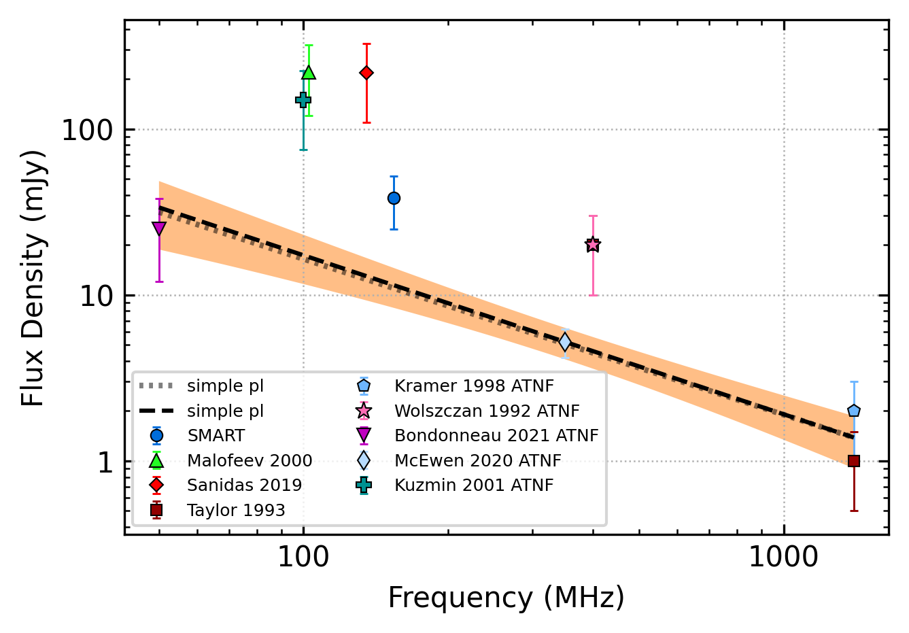
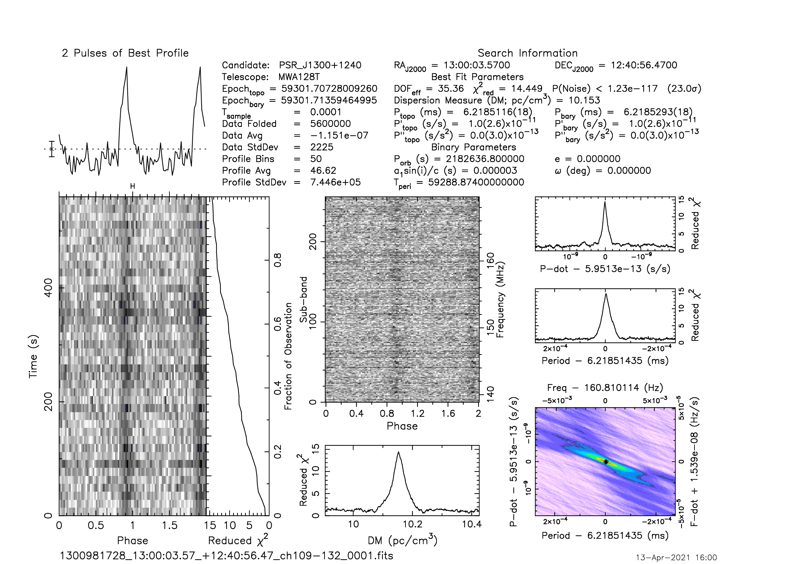

.. _J1300+1240:
J1300+1240
==========

Best Fit
--------

.. csv-table:: J1300+1240 fit results
   :header: "model","a","b","v0 (MHz)"

   "simple_power_law","-0.81±0.31","0.01±0.00","264±2"

Fit Before MWA
--------------

.. csv-table:: J1300+1240 before fit results
   :header: "model","a","b","v0 (MHz)"

   "simple_power_law","-0.79±0.32","0.01±0.00","264±2"

Flux Density Results
--------------------
.. csv-table:: J1300+1240 flux density total results
   :header: "N obs", "Flux Density (mJy)", "u_S_mean", "u_scint", "m_r_v"

   "2",  "38.4±24.9", "13.5", "32.7", "0.852"

.. csv-table:: J1300+1240 flux density individual results
   :header: "ObsID", "Flux Density (mJy)"

    "1300981728", "43.3±10.3"
    "1301847296", "33.6±8.8"

Comparison Fit
--------------
.. image:: comparison_fits/J1300+1240_comparison_fit.png
  :width: 800

Detection Plots
---------------

.. image:: on_pulse_plots/
  :width: 800
.. image:: detection_plots/pf_1301847296_J1300+1240_13:00:03.57_+12:40:56.47_b50_PSR_J1300+1240.pfd.png
  :width: 800

.. image:: on_pulse_plots/
  :width: 800