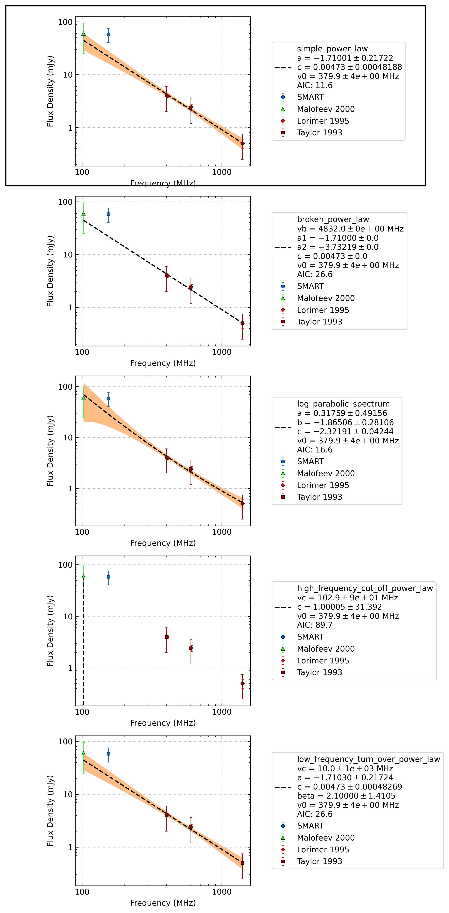

.. _J1311-1228:
J1311-1228
==========

Best Fit
--------
.. image:: best_fits/J1311-1228_simple_power_law_fit.png
  :width: 800

.. csv-table:: J1311-1228 fit results
   :header: "model","a","b"

   "simple_power_law","-1.78±0.24","0.00±0.00"

Fit Before MWA
--------------
.. image:: before_mwa/J1311-1228_simple_power_law_fit.png
  :width: 800

.. csv-table:: J1311-1228 before fit results
   :header: "model","a","b"

   "simple_power_law","-1.75±0.24","0.00±0.00"

Flux Density Results
--------------------
.. csv-table:: J1311-1228 flux density total results
   :header: "N obs", "Flux Density (mJy)", "u_S_mean", "u_scint", "m_r_v"

   "3",  "58.3±29.9", "17.5", "27.3", "0.469"

.. csv-table:: J1311-1228 flux density individual results
   :header: "ObsID", "Flux Density (mJy)"

    "1300809400", "101.5±12.8"
    "1301674968", "22.4±7.7"
    "1301847296", "50.8±9.2"

Comparison Fit
--------------

Detection Plots
---------------

.. image:: detection_plots/pf_1300809400_J1311-1228_13:11:52.64_-12:28:01.63_b1024_447.50ms_Cand.pfd.png
  :width: 800

.. image:: on_pulse_plots/1300809400_J1311-1228_1024_bins_gaussian_components.png
  :width: 800

.. image:: on_pulse_plots/1301674968_J1311-1228_128_bins_gaussian_components.png
  :width: 800

.. image:: on_pulse_plots/1301847296_J1311-1228_512_bins_gaussian_components.png
  :width: 800