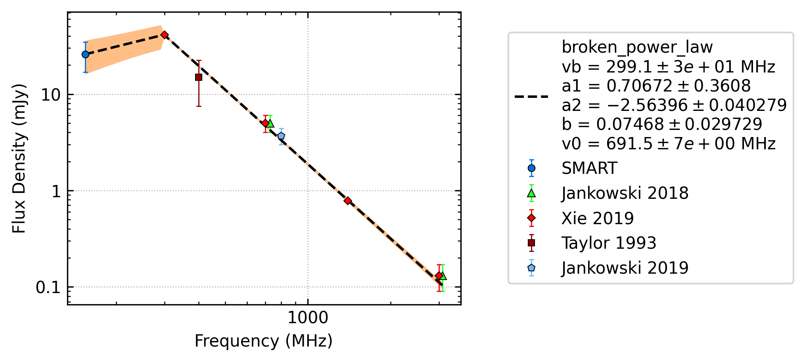
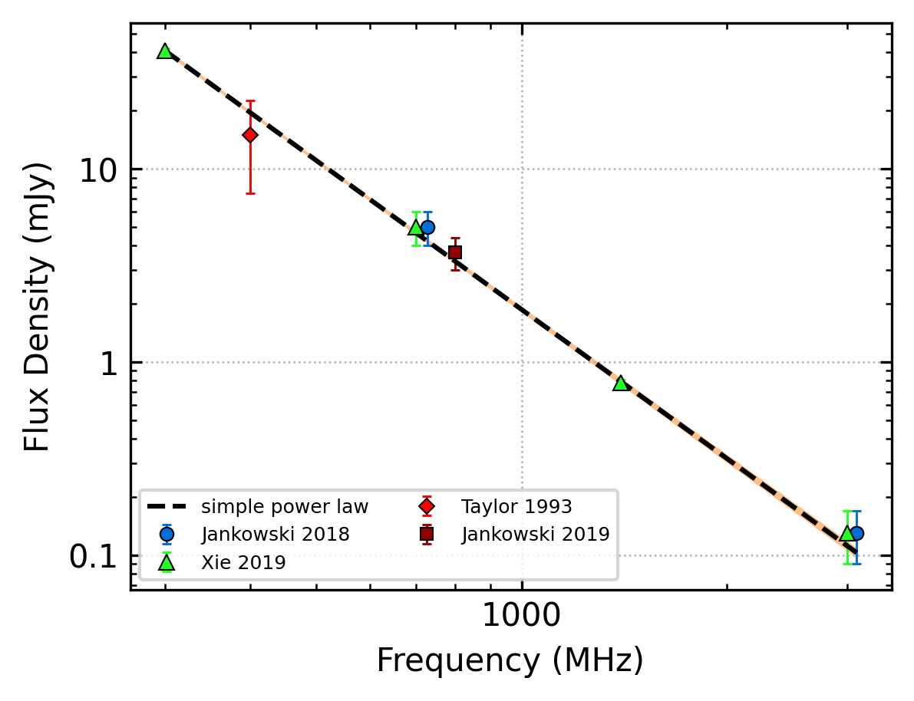
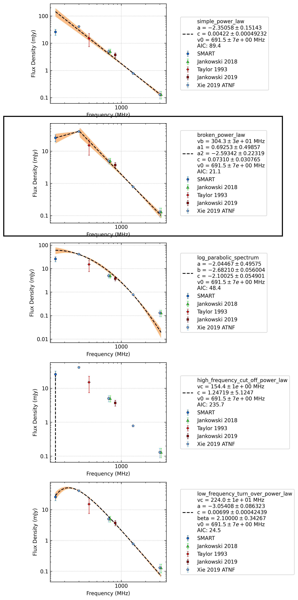
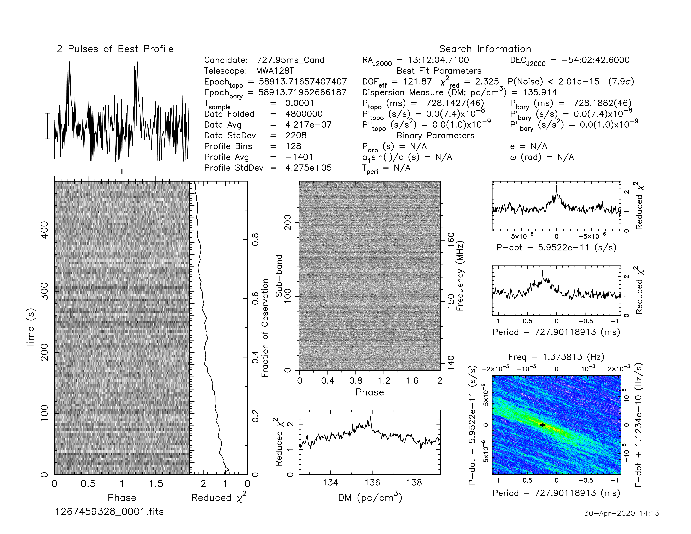

J1312-5402
==========

Best Fit
--------

.. csv-table:: J1312-5402 fit results
   :header: "model","vb (MHz)","a1","a2","b"

   "broken_power_law","301±25","0.91±0.53","-2.57±0.20","0.16±0.12"

Fit Before MWA
--------------

.. csv-table:: J1312-5402 before fit results
   :header: "model","a","b"

   "simple_power_law","-2.56±0.03","0.00±0.00"

Flux Density Results
--------------------
.. csv-table:: J1312-5402 flux density total results
   :header: "N obs", "Flux Density (mJy)", " u_S_mean", "u_scint", "m_r_v"

   "1",  "22.4±7.7", "5.2", "5.7", "0.254"

.. csv-table:: J1312-5402 flux density individual results
   :header: "ObsID", "Flux Density (mJy)"

    "1267459328", "22.4±5.2"

Comparison Fit
--------------

Detection Plots
---------------

.. image:: on_pulse_plots/1267459328_J1312-5402_128_bins_gaussian_components.png
  :width: 800