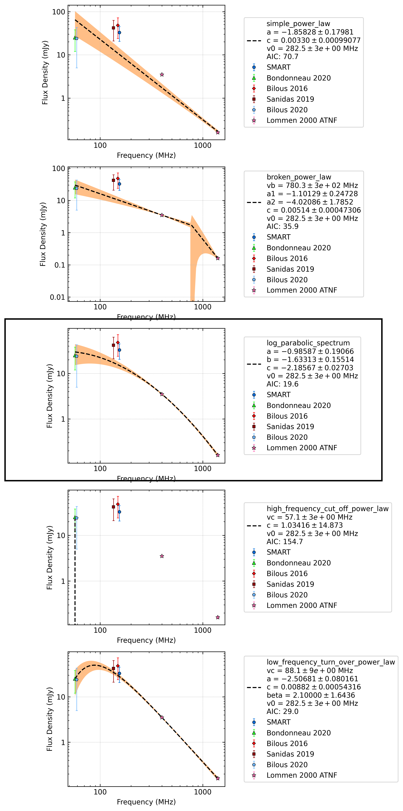

.. _J1313+0931:
J1313+0931
==========

Best Fit
--------

.. csv-table:: J1313+0931 fit results
   :header: "model","a","b","c","v0 (MHz)"

   "log_parabolic_spectrum","-0.98±0.22","-1.63±0.18","-2.19±0.03","282±2"

Fit Before MWA
--------------

.. csv-table:: J1313+0931 before fit results
   :header: "model","a","b","c","v0 (MHz)"

   "log_parabolic_spectrum","-1.00±0.23","-1.62±0.19","-2.19±0.03","282±2"

Flux Density Results
--------------------
.. csv-table:: J1313+0931 flux density total results
   :header: "N obs", "Flux Density (mJy)", "u_S_mean", "u_scint", "m_r_v"

   "2",  "32.8±20.5", "12.2", "25.8", "0.787"

.. csv-table:: J1313+0931 flux density individual results
   :header: "ObsID", "Flux Density (mJy)"

    "1300981728", "28.8±9.3"
    "1301847296", "36.8±7.9"

Comparison Fit
--------------

Detection Plots
---------------

.. image:: detection_plots/pf_1300981728_J1313+0931_13:13:23.00_+09:31:56.00_b128_848.89ms_Cand.pfd.png
  :width: 800

.. image:: on_pulse_plots/1300981728_J1313+0931_128_bins_gaussian_components.png
  :width: 800
.. image:: detection_plots/pf_1301847296_J1313+0931_13:13:23.00_+09:31:56.00_b512_848.91ms_Cand.pfd.png
  :width: 800

.. image:: on_pulse_plots/1301847296_J1313+0931_512_bins_gaussian_components.png
  :width: 800