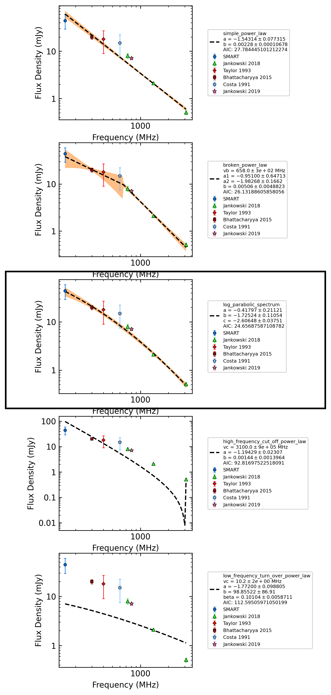
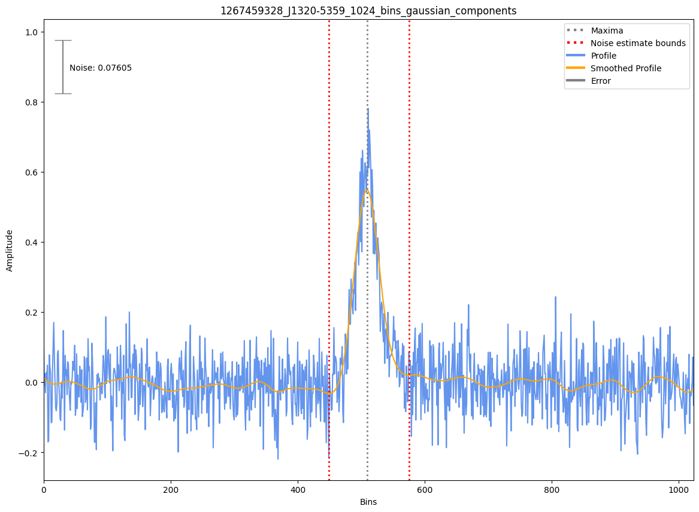
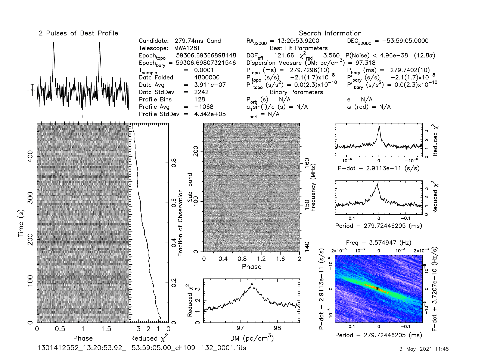
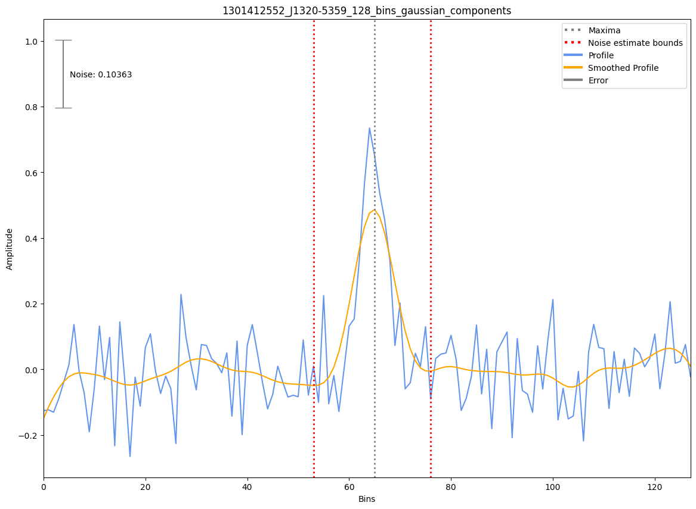

.. _J1320-5359:
J1320-5359
==========

Best Fit
--------
.. image:: best_fits/J1320-5359_o_fit.png
  :width: 800

.. csv-table:: J1320-5359 fit results
   :header: "model","a","b","c","v0 (MHz)"

   "o","-0.41±0.23","-1.51±0.08","-2.16±0.04","691±6"

Fit Before MWA
--------------

.. csv-table:: J1320-5359 before fit results
   :header: "model","a","b","c","v0 (MHz)"

   "o","-0.43±0.24","-1.63±0.09","-2.39±0.04","964±9"

Flux Density Results
--------------------
.. csv-table:: J1320-5359 flux density total results
   :header: "N obs", "Flux Density (mJy)", "u_S_mean", "u_scint", "m_r_v"

   "2",  "50.4±17.3", "11.2", "14.9", "0.295"

.. csv-table:: J1320-5359 flux density individual results
   :header: "ObsID", "Flux Density (mJy)"

    "1267459328", "64.7±6.6"
    "1301412552", "36.1±9.0"

Comparison Fit
--------------

Detection Plots
---------------

.. image:: detection_plots/1267459328_J1320-5359.prepfold.png
  :width: 800

