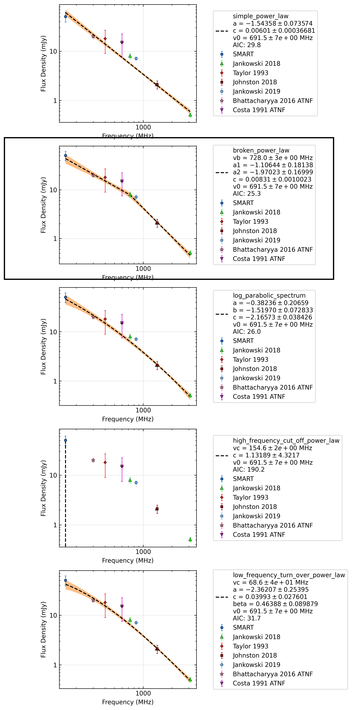

.. _J1320-5359:
J1320-5359
==========

Best Fit
--------
.. image:: best_fits/J1320-5359_log_parabolic_spectrum_fit.png
  :width: 800

.. csv-table:: J1320-5359 fit results
   :header: "model","a","b","c"

   "log_parabolic_spectrum","-0.42±0.21","-1.72±0.11","-2.61±0.04"

Fit Before MWA
--------------
.. image:: before_mwa/J1320-5359_log_parabolic_spectrum_fit.png
  :width: 800

.. csv-table:: J1320-5359 before fit results
   :header: "model","a","b","c"

   "log_parabolic_spectrum","-0.43±0.25","-1.73±0.12","-2.60±0.04"

Flux Density Results
--------------------
.. csv-table:: J1320-5359 flux density total results
   :header: "N obs", "Flux Density (mJy)", "u_S_mean", "u_scint", "m_r_v"

   "2",  "44.4±15.1", "10.0", "13.1", "0.295"

.. csv-table:: J1320-5359 flux density individual results
   :header: "ObsID", "Flux Density (mJy)"

    "1267459328", "56.2±5.7"
    "1301412552", "32.7±8.2"

Comparison Fit
--------------

Detection Plots
---------------

.. image:: detection_plots/1267459328_J1320-5359.prepfold.png
  :width: 800

.. image:: on_pulse_plots/1267459328_J1320-5359_1024_bins_gaussian_components.png
  :width: 800

.. image:: on_pulse_plots/1301412552_J1320-5359_128_bins_gaussian_components.png
  :width: 800