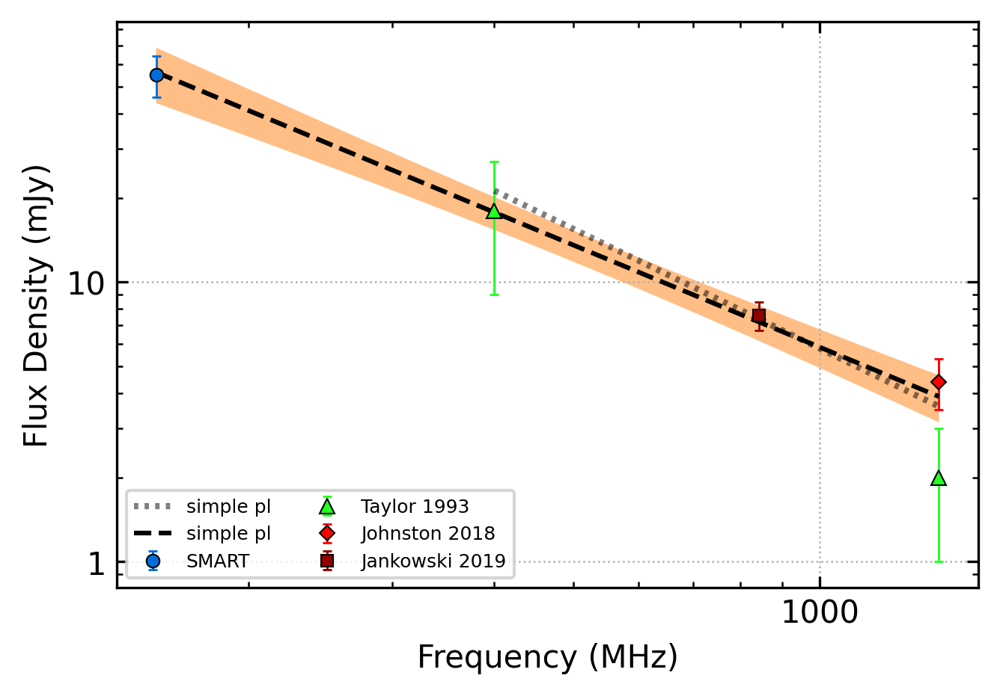
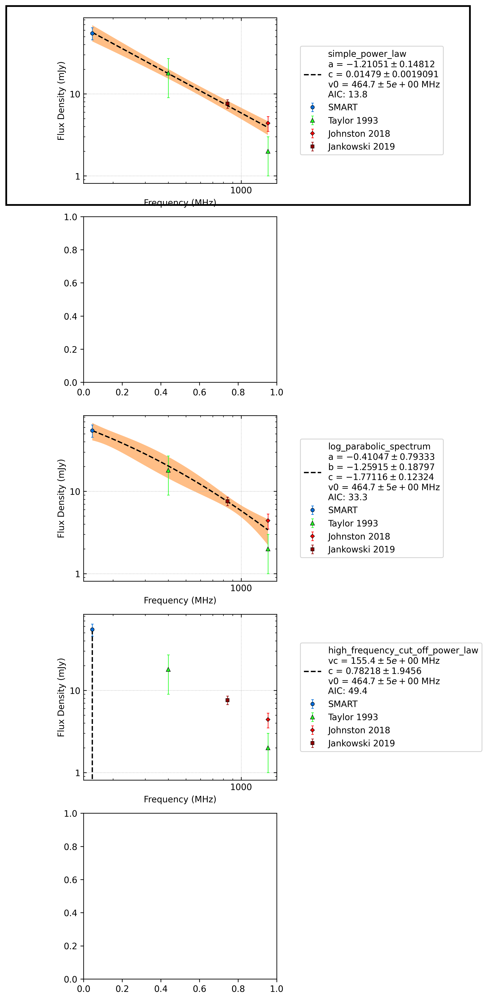

.. _J1328-4357:
J1328-4357
==========

Best Fit
--------

.. csv-table:: J1328-4357 fit results
   :header: "model","a","c","v0 (MHz)"

   "simple_power_law","-1.21±0.15","0.01±0.00","464±4"

Fit Before MWA
--------------

.. csv-table:: J1328-4357 before fit results
   :header: "model","a","c","v0 (MHz)"

   "simple_power_law","-1.42±0.50","0.01±0.00","748±7"

Flux Density Results
--------------------
.. csv-table:: J1328-4357 flux density total results
   :header: "N obs", "Flux Density (mJy)", "u_S_mean", "u_scint", "m_r_v"

   "1",  "54.9±25.7", "9.3", "24.0", "0.437"

.. csv-table:: J1328-4357 flux density individual results
   :header: "ObsID", "Flux Density (mJy)"

    "1301412552", "54.9±9.3"

Comparison Fit
--------------

Detection Plots
---------------

.. image:: detection_plots/pf_1301412552_J1328-4357_13:28:06.43_-43:57:44.12_b512_532.69ms_Cand.pfd.png
  :width: 800

.. image:: on_pulse_plots/1301412552_J1328-4357_512_bins_gaussian_components.png
  :width: 800