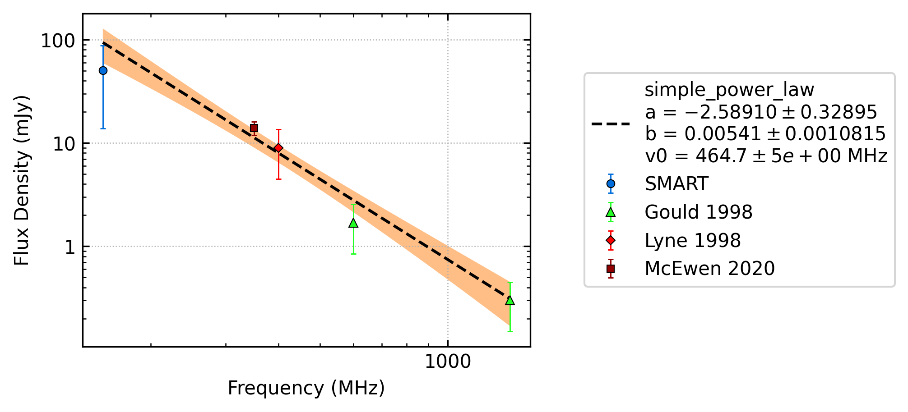
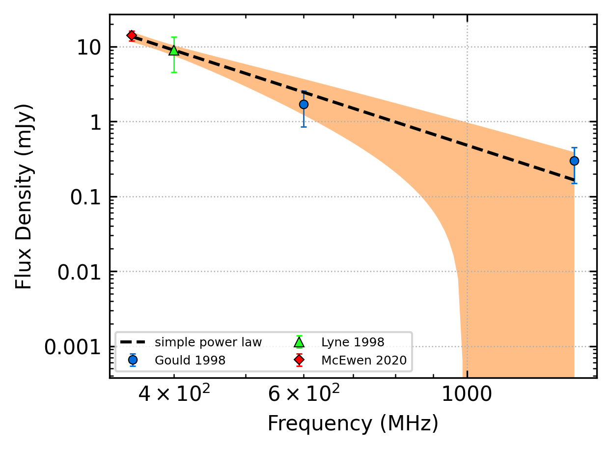
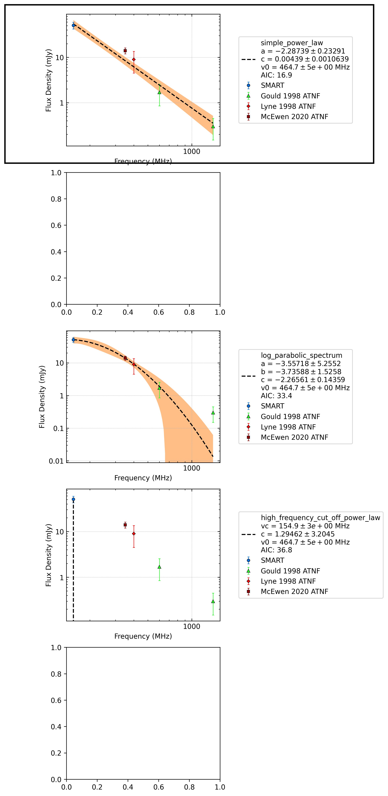
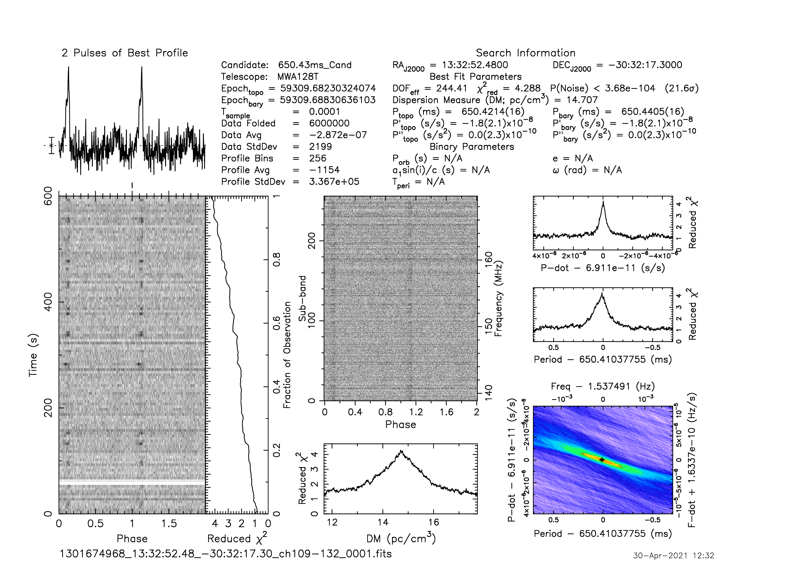

.. _J1332-3032:
J1332-3032
==========

Best Fit
--------

.. csv-table:: J1332-3032 fit results
   :header: "model","a","b"

   "simple_power_law","-2.54±0.31","0.00±0.00"

Fit Before MWA
--------------

.. csv-table:: J1332-3032 before fit results
   :header: "model","a","b"

   "simple_power_law","-3.18±1.02","0.00±0.00"

Flux Density Results
--------------------
.. csv-table:: J1332-3032 flux density total results
   :header: "N obs", "Flux Density (mJy)", "u_S_mean", "u_scint", "m_r_v"

   "1",  "46.0±33.4", "7.7", "32.5", "0.707"

.. csv-table:: J1332-3032 flux density individual results
   :header: "ObsID", "Flux Density (mJy)"

    "1301674968", "46.0±7.7"

Comparison Fit
--------------

Detection Plots
---------------

.. image:: on_pulse_plots/1301674968_J1332-3032_256_bins_gaussian_components.png
  :width: 800