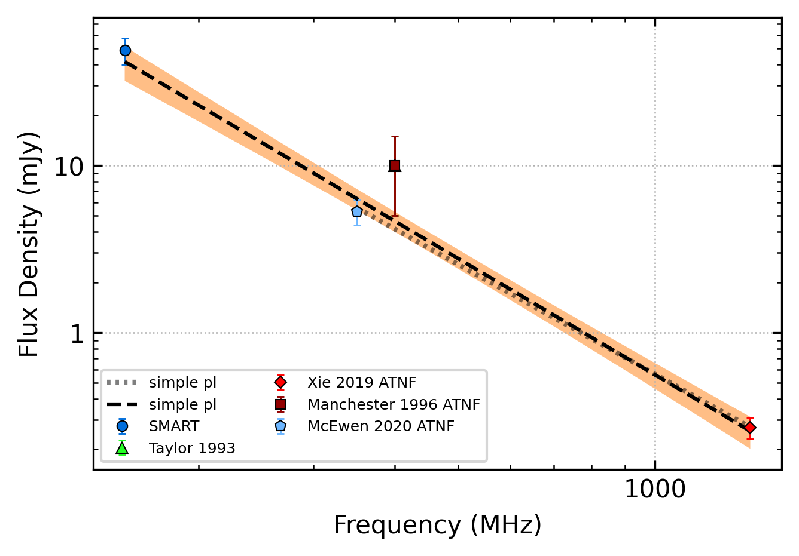
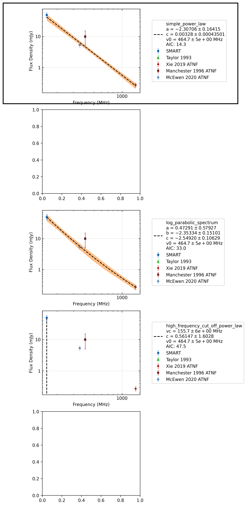

.. _J1335-3642:
J1335-3642
==========

Best Fit
--------

.. csv-table:: J1335-3642 fit results
   :header: "model","a","c","v0 (MHz)"

   "simple_power_law","-2.31±0.16","0.00±0.00","464±4"

Fit Before MWA
--------------

.. csv-table:: J1335-3642 before fit results
   :header: "model","a","c","v0 (MHz)"

   "simple_power_law","-2.18±0.22","0.00±0.00","700±7"

Flux Density Results
--------------------
.. csv-table:: J1335-3642 flux density total results
   :header: "N obs", "Flux Density (mJy)", "u_S_mean", "u_scint", "m_r_v"

   "1",  "48.9±23.2", "8.9", "21.4", "0.438"

.. csv-table:: J1335-3642 flux density individual results
   :header: "ObsID", "Flux Density (mJy)"

    "1301412552", "48.9±8.9"

Comparison Fit
--------------

Detection Plots
---------------

.. image:: on_pulse_plots/1301412552_J1335-3642_256_bins_gaussian_components.png
  :width: 800