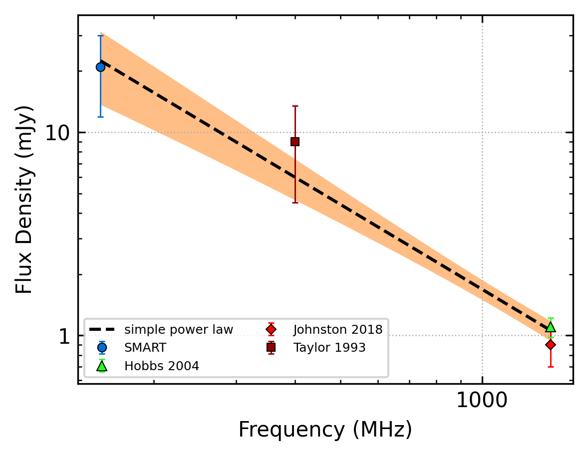
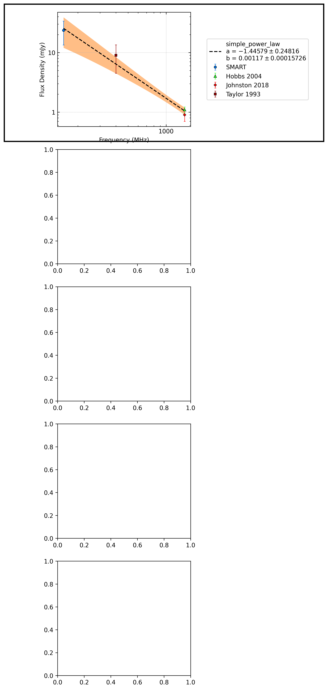
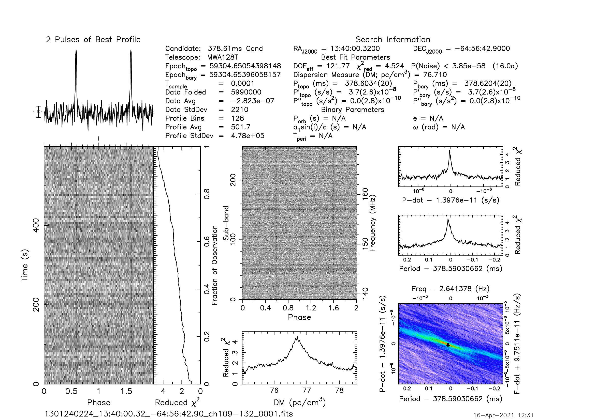
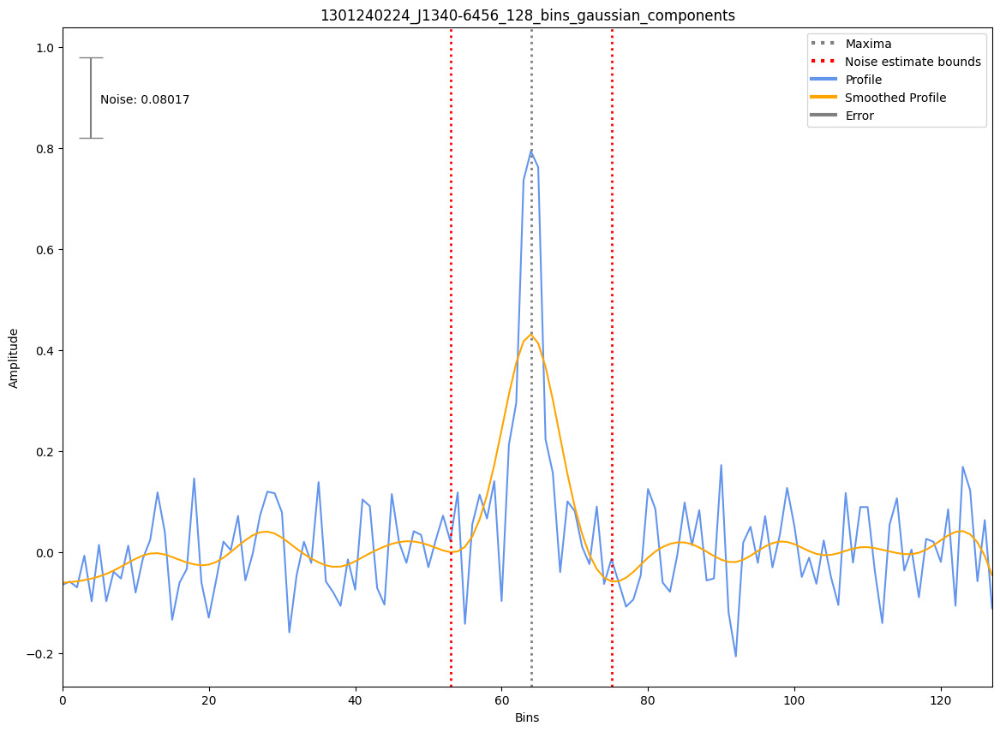

.. _J1340-6456:
J1340-6456
==========

Best Fit
--------

.. csv-table:: J1340-6456 fit results
   :header: "model","a","b"

   "simple_power_law","-1.45±0.25","0.00±0.00"

Flux Density Results
--------------------
.. csv-table:: J1340-6456 flux density total results
   :header: "N obs", "Flux Density (mJy)", "u_S_mean", "u_scint", "m_r_v"

   "1",  "23.6±10.2", "6.5", "7.8", "0.329"

.. csv-table:: J1340-6456 flux density individual results
   :header: "ObsID", "Flux Density (mJy)"

    "1301240224", "23.6±6.5"

Comparison Fit
--------------

Detection Plots
---------------

