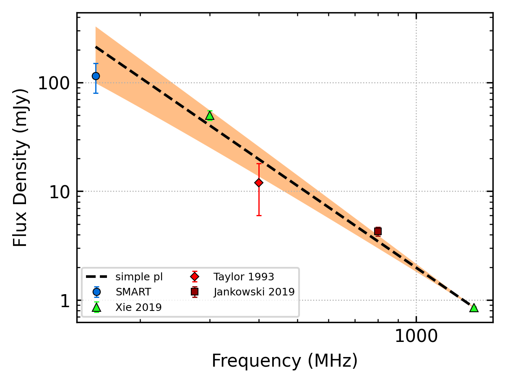
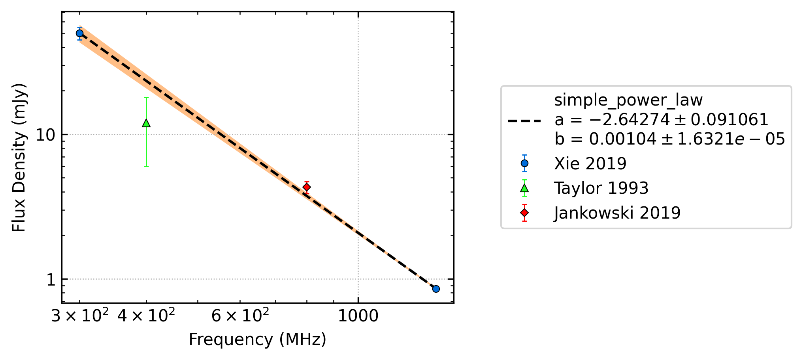
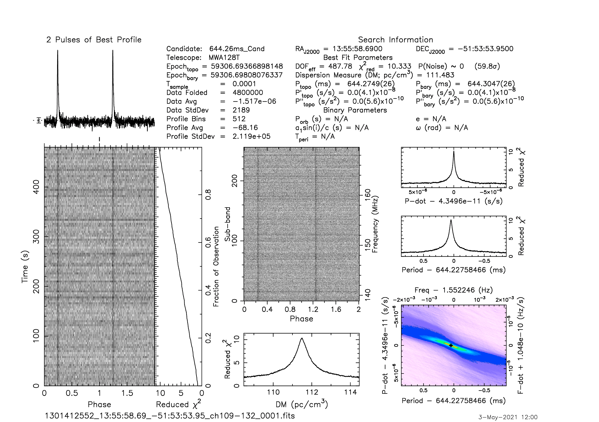
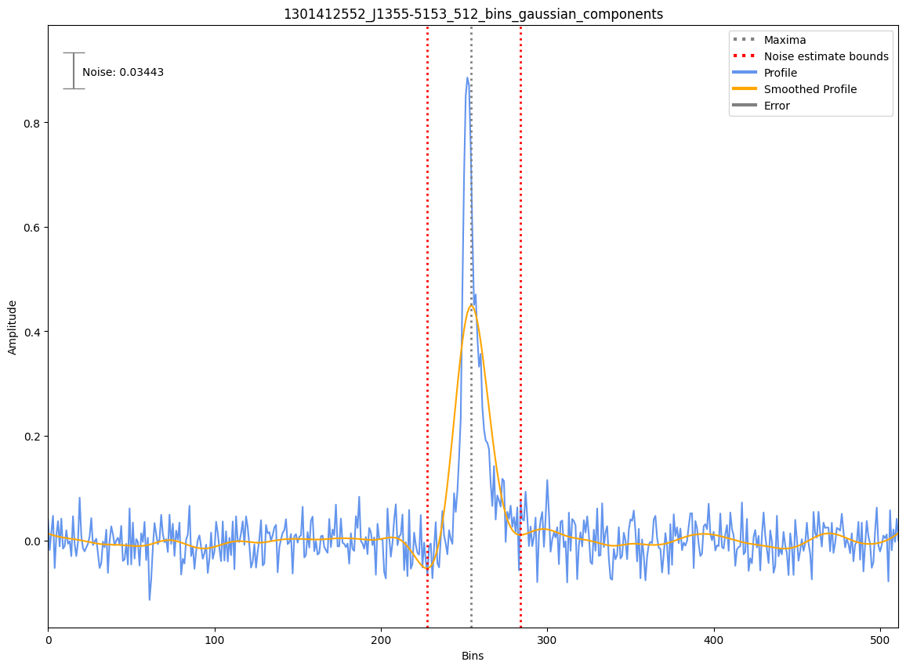
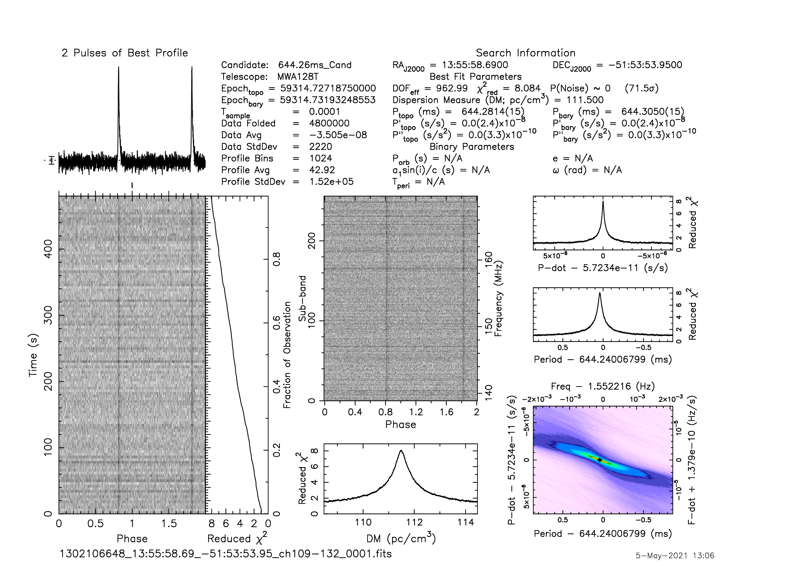
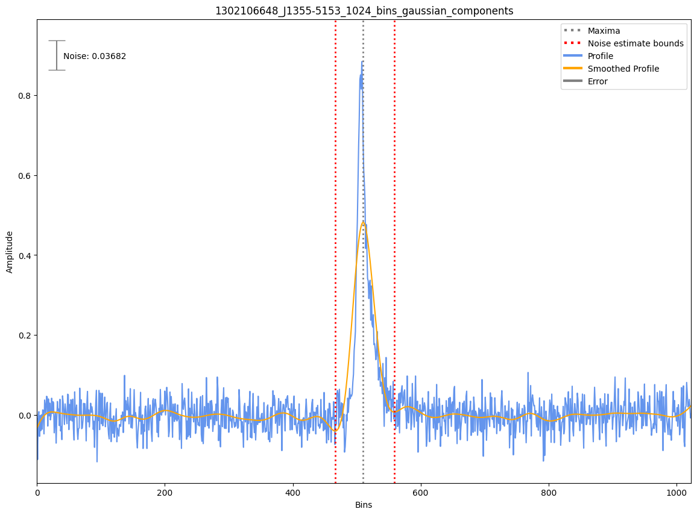

.. _J1355-5153:
J1355-5153
==========

Best Fit
--------

.. csv-table:: J1355-5153 fit results
   :header: "model","a","b"

   "simple_power_law","-2.46±0.18","0.00±0.00"

Fit Before MWA
--------------

.. csv-table:: J1355-5153 before fit results
   :header: "model","a","b"

   "simple_power_law","-2.64±0.06","0.00±0.00"

Flux Density Results
--------------------
.. csv-table:: J1355-5153 flux density total results
   :header: "N obs", "Flux Density (mJy)", "u_S_mean", "u_scint", "m_r_v"

   "2",  "106.0±32.6", "18.9", "29.2", "0.276"

.. csv-table:: J1355-5153 flux density individual results
   :header: "ObsID", "Flux Density (mJy)"

    "1301412552", "76.6±11.4"
    "1302106648", "135.4±15.1"

Comparison Fit
--------------
.. image:: comparison_fits/J1355-5153_comparison_fit.png
  :width: 800

Detection Plots
---------------

