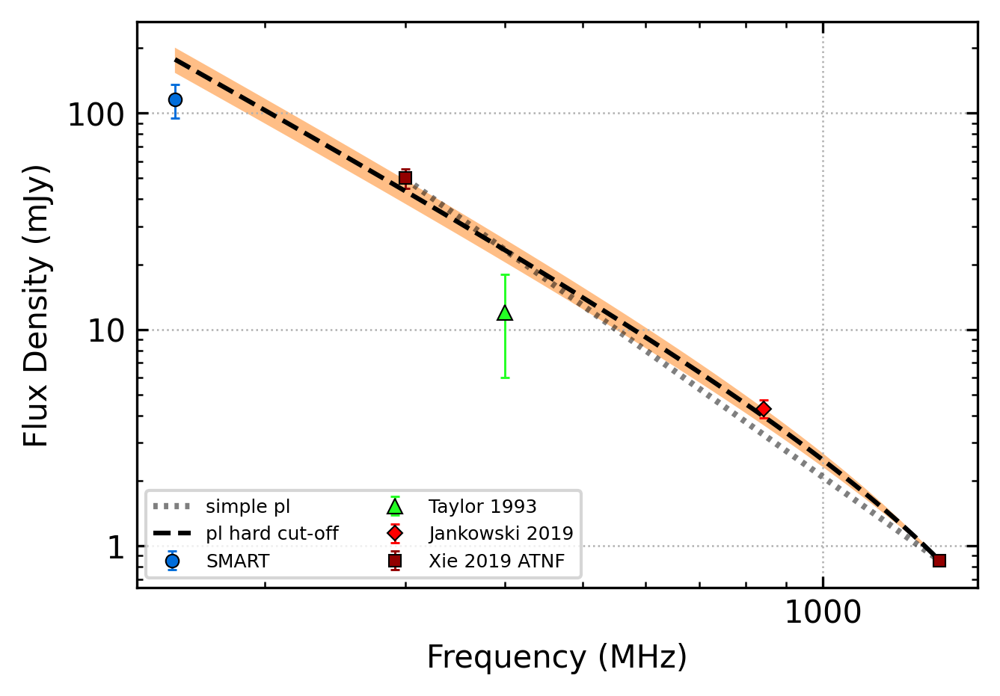
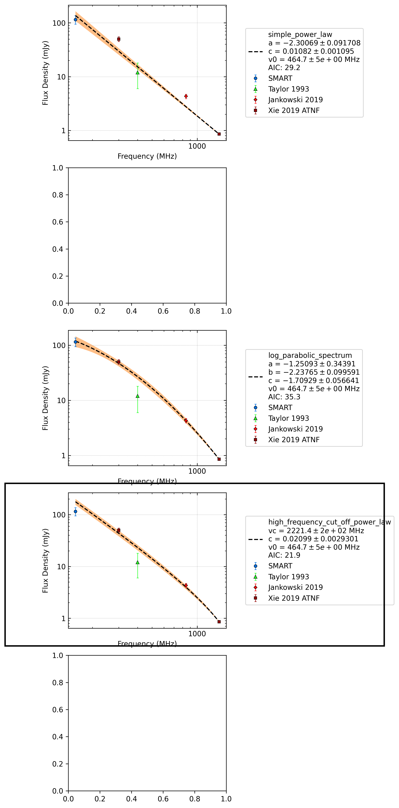

.. _J1355-5153:
J1355-5153
==========

Best Fit
--------

.. csv-table:: J1355-5153 fit results
   :header: "model","vc (MHz)","b","v0 (MHz)"

   "high_frequency_cut_off_power_law","3000±296","0.01±0.00","464±4"

Fit Before MWA
--------------

.. csv-table:: J1355-5153 before fit results
   :header: "model","a","b","v0 (MHz)"

   "simple_power_law","-2.64±0.09","0.01±0.00","648±6"

Flux Density Results
--------------------
.. csv-table:: J1355-5153 flux density total results
   :header: "N obs", "Flux Density (mJy)", "u_S_mean", "u_scint", "m_r_v"

   "2",  "115.4±35.1", "20.6", "31.8", "0.276"

.. csv-table:: J1355-5153 flux density individual results
   :header: "ObsID", "Flux Density (mJy)"

    "1301412552", "84.5±12.6"
    "1302106648", "146.3±16.3"

Comparison Fit
--------------

Detection Plots
---------------

.. image:: on_pulse_plots/1301412552_J1355-5153_512_bins_gaussian_components.png
  :width: 800
.. image:: detection_plots/pf_1302106648_J1355-5153_13:55:58.69_-51:53:53.95_b1024_644.26ms_Cand.pfd.png
  :width: 800

.. image:: on_pulse_plots/1302106648_J1355-5153_1024_bins_gaussian_components.png
  :width: 800