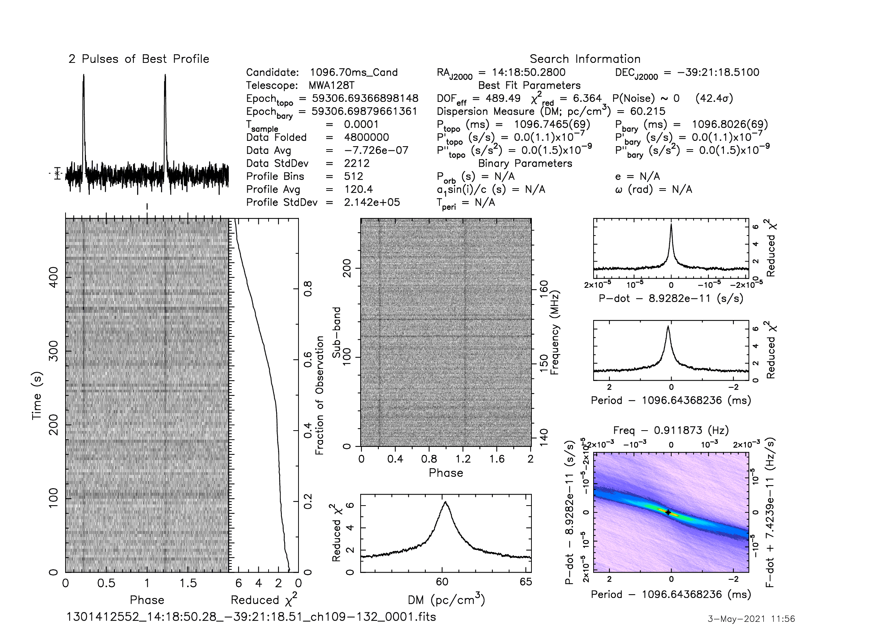
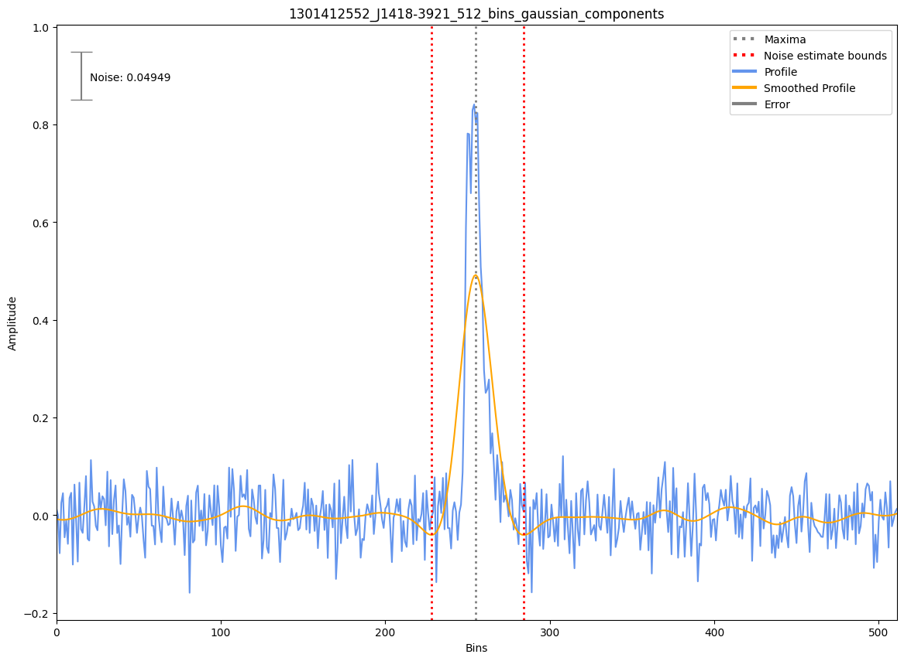
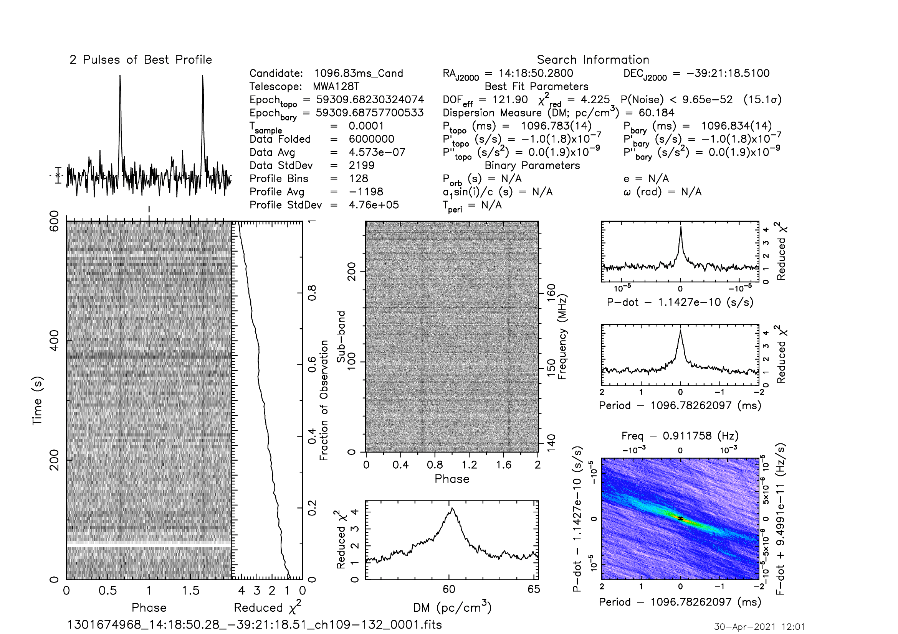
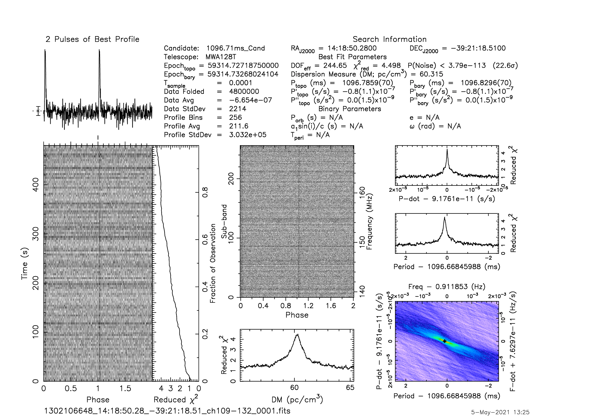
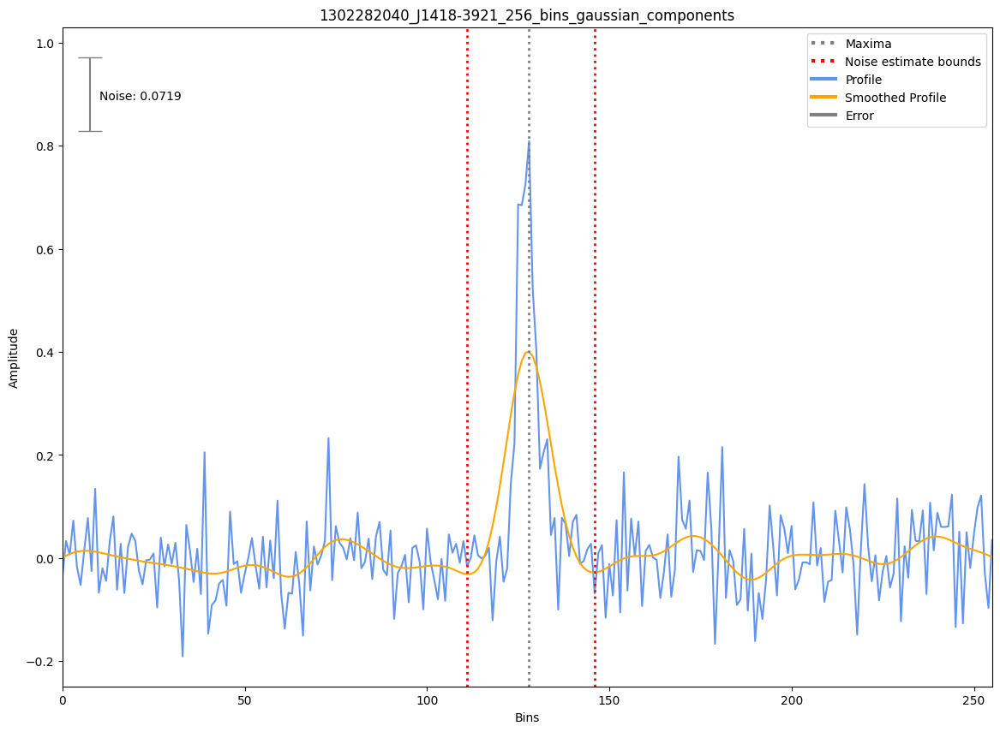

.. _J1418-3921:
J1418-3921
==========

Best Fit
--------
Only 4 MWA data and 2 cat data available

Flux Density Results
--------------------
.. csv-table:: J1418-3921 flux density total results
   :header: "N obs", "Flux Density (mJy)", "u_S_mean", "u_scint", "m_r_v"

   "4",  "46.2±20.9", "19.7", "17.0", "0.368"

.. csv-table:: J1418-3921 flux density individual results
   :header: "ObsID", "Flux Density (mJy)"

    "1301412552", "58.2±9.0"
    "1301674968", "26.1±7.6"
    "1302106648", "49.2±10.7"
    "1302282040", "51.3±11.7"

Detection Plots
---------------

.. image:: on_pulse_plots/1301674968_J1418-3921_128_bins_gaussian_components.png
  :width: 800

.. image:: on_pulse_plots/1302106648_J1418-3921_256_bins_gaussian_components.png
  :width: 800
.. image:: detection_plots/pf_1302282040_J1418-3921_14:18:50.28_-39:21:18.51_b256_1096.72ms_Cand.pfd.png
  :width: 800

