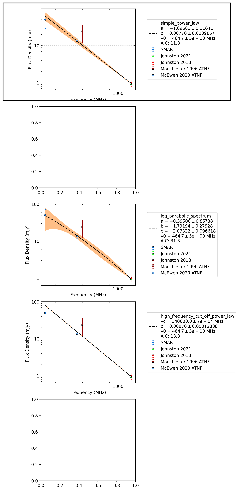

.. _J1418-3921:
J1418-3921
==========

Best Fit
--------
.. image:: best_fits/J1418-3921_simple_power_law_fit.png
  :width: 800

.. csv-table:: J1418-3921 fit results
   :header: "model","a","b","v0 (MHz)"

   "simple_power_law","-1.90±0.12","0.01±0.00","464±4"

Flux Density Results
--------------------
.. csv-table:: J1418-3921 flux density total results
   :header: "N obs", "Flux Density (mJy)", "u_S_mean", "u_scint", "m_r_v"

   "4",  "50.3±22.7", "21.4", "18.5", "0.368"

.. csv-table:: J1418-3921 flux density individual results
   :header: "ObsID", "Flux Density (mJy)"

    "1301412552", "64.3±10.0"
    "1301674968", "28.9±8.4"
    "1302106648", "53.2±11.5"
    "1302282040", "55.0±12.5"

Comparison Fit
--------------

Detection Plots
---------------

.. image:: on_pulse_plots/1301412552_J1418-3921_512_bins_gaussian_components.png
  :width: 800
.. image:: detection_plots/pf_1301674968_J1418-3921_14:18:50.28_-39:21:18.51_b128_1096.83ms_Cand.pfd.png
  :width: 800

.. image:: on_pulse_plots/1301674968_J1418-3921_128_bins_gaussian_components.png
  :width: 800

.. image:: on_pulse_plots/1302106648_J1418-3921_256_bins_gaussian_components.png
  :width: 800
.. image:: detection_plots/pf_1302282040_J1418-3921_14:18:50.28_-39:21:18.51_b256_1096.72ms_Cand.pfd.png
  :width: 800

.. image:: on_pulse_plots/1302282040_J1418-3921_256_bins_gaussian_components.png
  :width: 800