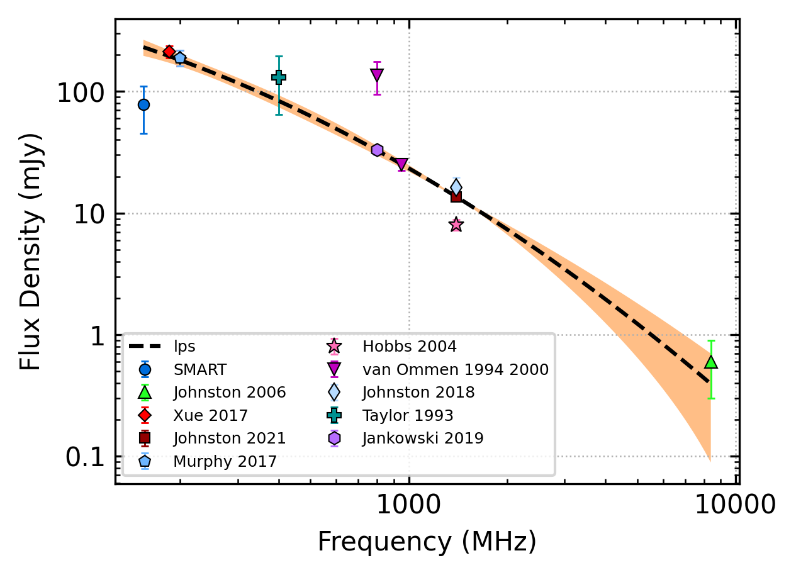
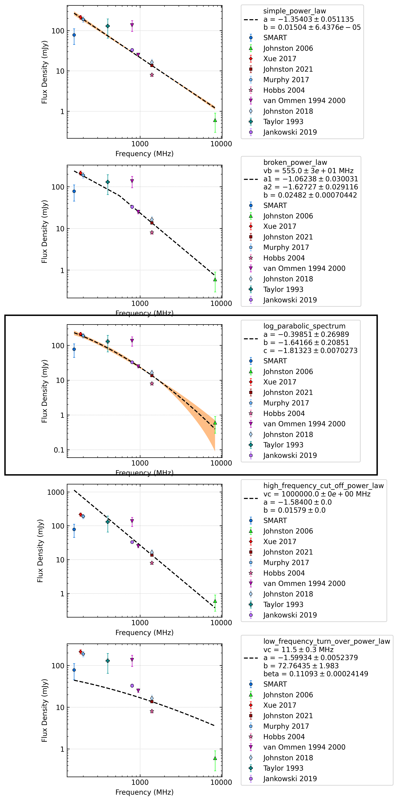
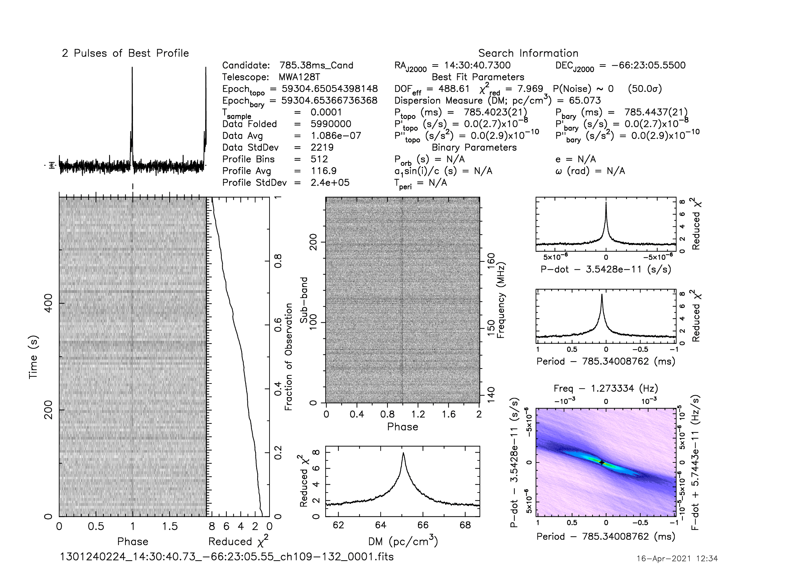
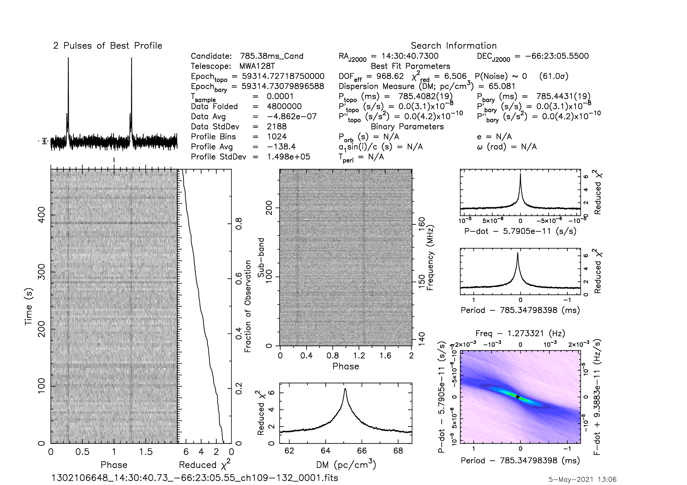

J1430-6623
==========

Best Fit
--------

.. csv-table:: J1430-6623 fit results
   :header: "model","a","b","c"

   "log_parabolic_spectrum","-1.96±0.42","-2.97±0.32","-1.99±0.04"

Fit Before MWA
--------------
.. image:: before_mwa/J1430-6623_log_parabolic_spectrum_fit.png
  :width: 800

.. csv-table:: J1430-6623 before fit results
   :header: "model","a","b","c"

   "log_parabolic_spectrum","-1.56±0.38","-2.83±0.32","-1.99±0.04"

Flux Density Results
--------------------
.. csv-table:: J1430-6623 flux density total results
   :header: "N obs", "Flux Density (mJy)", "u_S_mean", "u_scint", "m_r_v"

   "2",  "71.5±30.6", "16.0", "25.5", "0.356"

.. csv-table:: J1430-6623 flux density individual results
   :header: "ObsID", "Flux Density (mJy)"

    "1301240224", "39.8±7.6"
    "1302106648", "103.2±14.1"

Comparison Fit
--------------

Detection Plots
---------------

.. image:: on_pulse_plots/1301240224_J1430-6623_512_bins_gaussian_components.png
  :width: 800

.. image:: on_pulse_plots/1302106648_J1430-6623_1024_bins_gaussian_components.png
  :width: 800