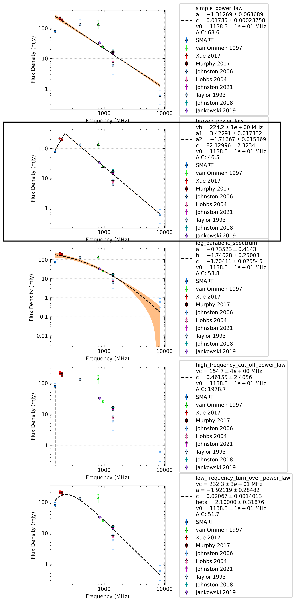

.. _J1430-6623:
J1430-6623
==========

Best Fit
--------
.. image:: best_fits/J1430-6623_low_frequency_turn_over_power_law_fit.png
  :width: 800

.. csv-table:: J1430-6623 fit results
   :header: "model","vc (MHz)","a","b","beta","v0 (MHz)"

   "low_frequency_turn_over_power_law","197±29","-1.76±0.17","0.02±0.00","2.10±1.33","1138±11"

Fit Before MWA
--------------
.. image:: before_mwa/J1430-6623_log_parabolic_spectrum_fit.png
  :width: 800

.. csv-table:: J1430-6623 before fit results
   :header: "model","a","b","c","v0 (MHz)"

   "log_parabolic_spectrum","-0.29±0.23","-1.58±0.17","-1.79±0.01","1246±12"

Flux Density Results
--------------------
.. csv-table:: J1430-6623 flux density total results
   :header: "N obs", "Flux Density (mJy)", "u_S_mean", "u_scint", "m_r_v"

   "2",  "78.2±32.9", "17.5", "27.8", "0.356"

.. csv-table:: J1430-6623 flux density individual results
   :header: "ObsID", "Flux Density (mJy)"

    "1301240224", "44.9±8.6"
    "1302106648", "111.5±15.2"

Comparison Fit
--------------

Detection Plots
---------------

.. image:: detection_plots/pf_1301240224_J1430-6623_14:30:40.73_-66:23:05.55_b512_785.38ms_Cand.pfd.png
  :width: 800

.. image:: on_pulse_plots/1301240224_J1430-6623_512_bins_gaussian_components.png
  :width: 800

.. image:: on_pulse_plots/1302106648_J1430-6623_1024_bins_gaussian_components.png
  :width: 800