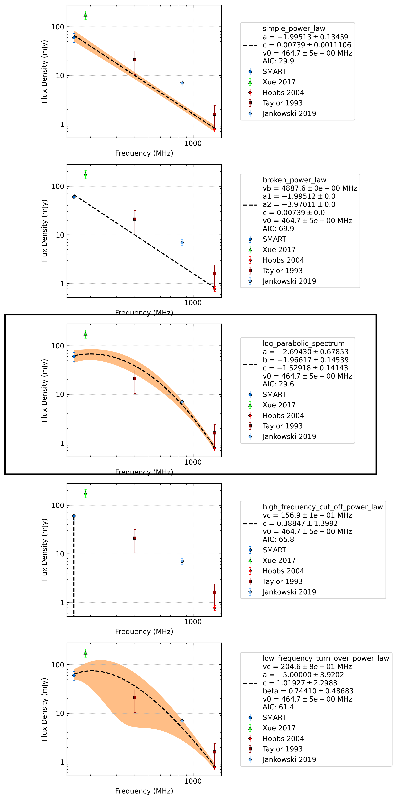

.. _J1440-6344:
J1440-6344
==========

Best Fit
--------
.. image:: best_fits/J1440-6344_i_fit.png
  :width: 800

.. csv-table:: J1440-6344 fit results
   :header: "model","vc (MHz)","b","v0 (MHz)"

   "i","5845±7386","0.01±0.00","464±4"

Fit Before MWA
--------------

.. csv-table:: J1440-6344 before fit results
   :header: "model","a","b","v0 (MHz)"

   "i","-2.68±0.15","0.01±0.00","508±5"

Flux Density Results
--------------------
.. csv-table:: J1440-6344 flux density total results
   :header: "N obs", "Flux Density (mJy)", "u_S_mean", "u_scint", "m_r_v"

   "1",  "60.0±20.0", "12.3", "15.8", "0.263"

.. csv-table:: J1440-6344 flux density individual results
   :header: "ObsID", "Flux Density (mJy)"

    "1302106648", "60.0±12.3"

Comparison Fit
--------------

Detection Plots
---------------

.. image:: on_pulse_plots/1302106648_J1440-6344_256_bins_gaussian_components.png
  :width: 800