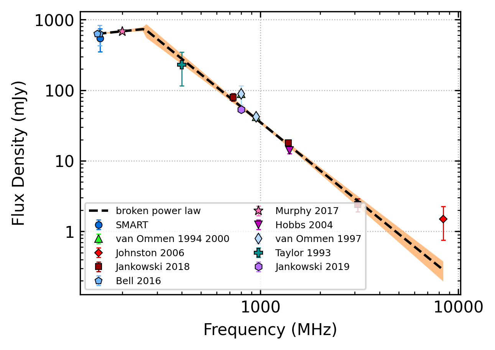
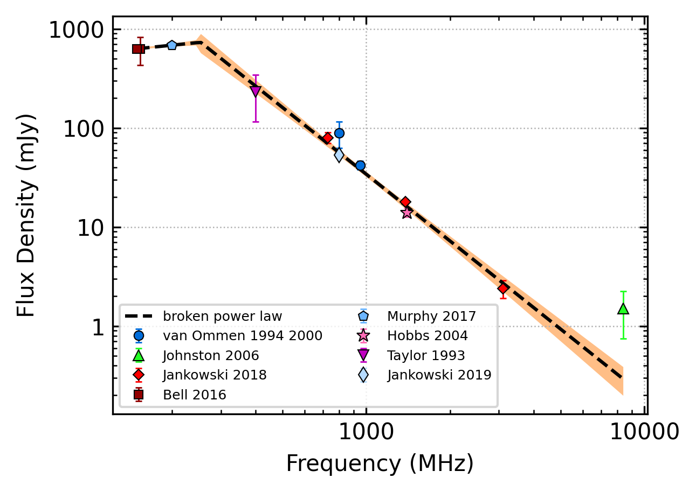
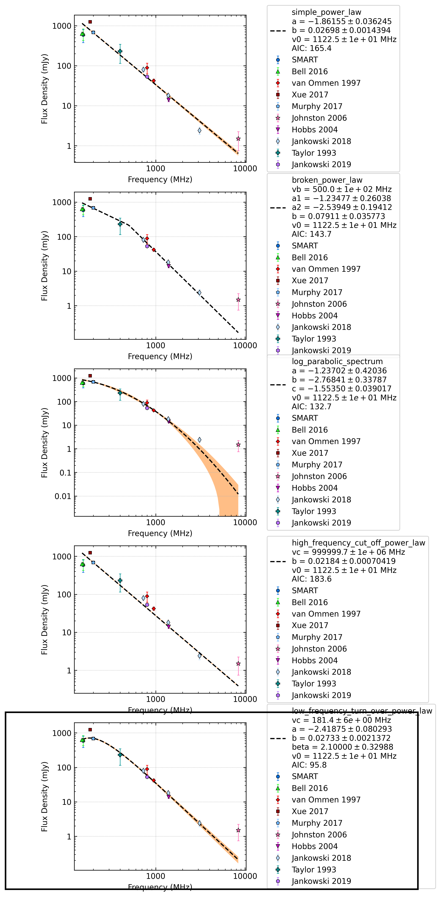
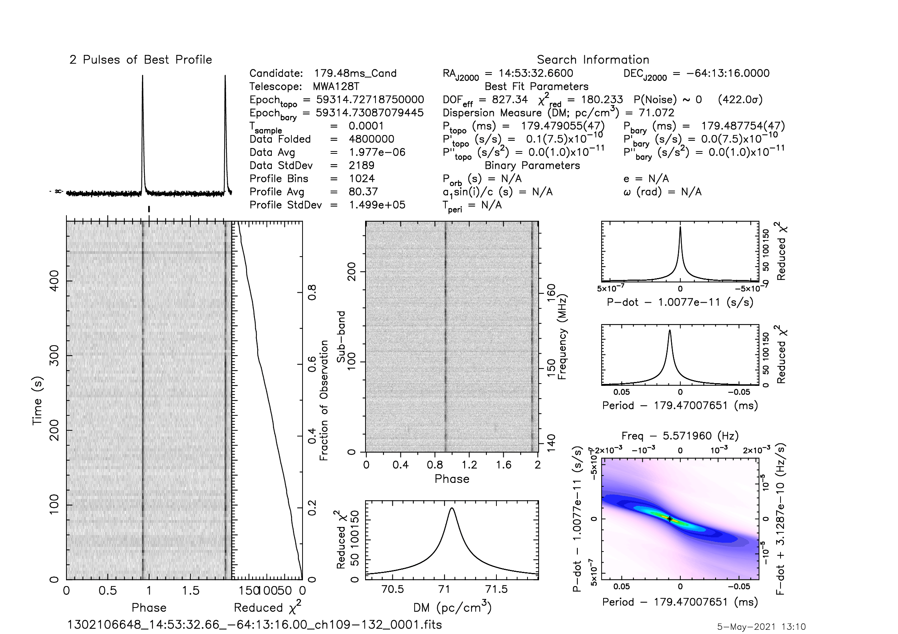

.. _J1453-6413:
J1453-6413
==========

Best Fit
--------

.. csv-table:: J1453-6413 fit results
   :header: "model","vb (MHz)","a1","a2","b"

   "broken_power_law","253±23","0.29±0.16","-2.24±0.15","1.18±0.38"

Fit Before MWA
--------------

.. csv-table:: J1453-6413 before fit results
   :header: "model","vb (MHz)","a1","a2","b"

   "broken_power_law","253±23","0.29±0.16","-2.24±0.15","1.17±0.38"

Flux Density Results
--------------------
.. csv-table:: J1453-6413 flux density total results
   :header: "N obs", "Flux Density (mJy)", "u_S_mean", "u_scint", "m_r_v"

   "1",  "546.0±195.4", "59.1", "186.2", "0.341"

.. csv-table:: J1453-6413 flux density individual results
   :header: "ObsID", "Flux Density (mJy)"

    "1302106648", "546.0±59.1"

Comparison Fit
--------------

Detection Plots
---------------

.. image:: on_pulse_plots/1302106648_J1453-6413_1024_bins_gaussian_components.png
  :width: 800