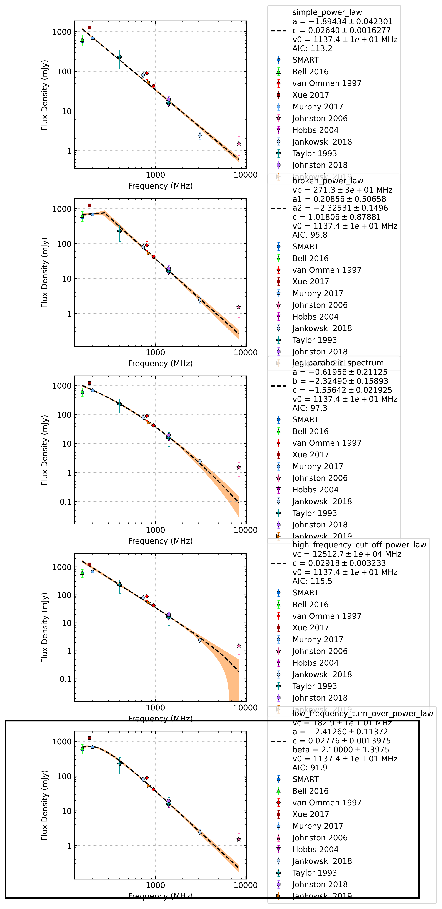

.. _J1453-6413:
J1453-6413
==========

Best Fit
--------

.. csv-table:: J1453-6413 fit results
   :header: "model","vpeak (MHz)","a","c","beta","v0 (MHz)"

   "low_frequency_turn_over_power_law","192±8","-2.65±0.17","0.05±0.00","2.10±0.14","923±9"

Fit Before MWA
--------------

.. csv-table:: J1453-6413 before fit results
   :header: "model","vpeak (MHz)","a","c","beta","v0 (MHz)"

   "low_frequency_turn_over_power_law","192±8","-2.65±0.17","0.05±0.00","2.10±0.14","923±9"

Flux Density Results
--------------------
.. csv-table:: J1453-6413 flux density total results
   :header: "N obs", "Flux Density (mJy)", "u_S_mean", "u_scint", "m_r_v"

   "1",  "589.9±211.1", "63.9", "201.2", "0.341"

.. csv-table:: J1453-6413 flux density individual results
   :header: "ObsID", "Flux Density (mJy)"

    "1302106648", "589.9±63.9"

Comparison Fit
--------------

Detection Plots
---------------

.. image:: on_pulse_plots/1302106648_J1453-6413_1024_bins_gaussian_components.png
  :width: 800