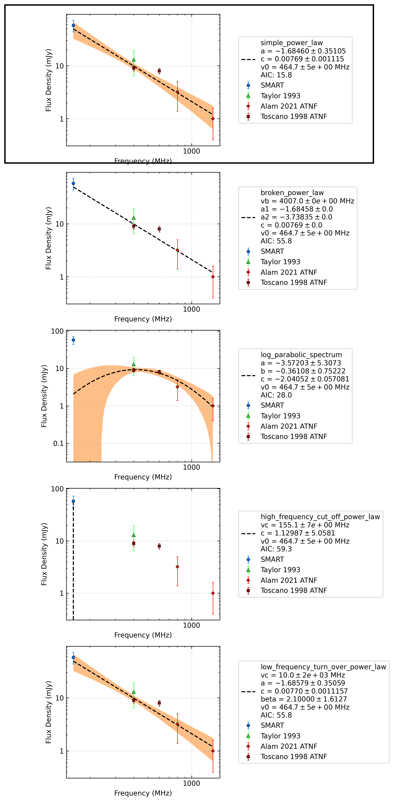

J1455-3330
==========

Best Fit
--------
.. image:: best_fits/J1455-3330_simple_power_law_fit.png
  :width: 800

.. csv-table:: J1455-3330 fit results
   :header: "model","a","b"

   "simple_power_law","-1.52±0.35","0.00±0.00"

Fit Before MWA
--------------
.. image:: before_mwa/J1455-3330_simple_power_law_fit.png
  :width: 800

.. csv-table:: J1455-3330 before fit results
   :header: "model","a","b"

   "simple_power_law","-1.48±0.36","0.00±0.00"

Flux Density Results
--------------------
.. csv-table:: J1455-3330 flux density total results
   :header: "N obs", "Flux Density (mJy)", " u_S_mean", "u_scint", "m_r_v"

   "1",  "54.2±42.5", "13.5", "40.3", "0.744"

.. csv-table:: J1455-3330 flux density individual results
   :header: "ObsID", "Flux Density (mJy)"

    "1302282040", "54.2±13.5"

Comparison Fit
--------------

Detection Plots
---------------

.. image:: detection_plots/pf_1302282040_J1455-3330_14:55:47.96_-33:30:46.39_b50_PSR_J1455-3330.pfd.png
  :width: 800

.. image:: on_pulse_plots/
  :width: 800