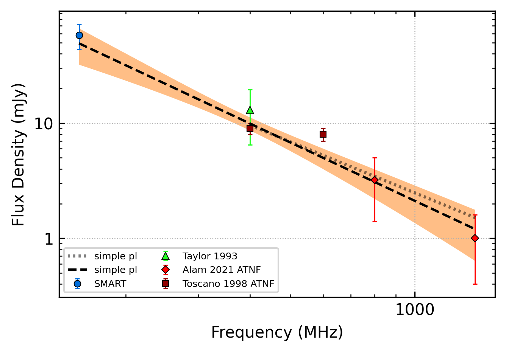

.. _J1455-3330:
J1455-3330
==========

Best Fit
--------

.. csv-table:: J1455-3330 fit results
   :header: "model","a","c","v0 (MHz)"

   "simple_power_law","-1.68±0.35","0.01±0.00","464±4"

Fit Before MWA
--------------

.. csv-table:: J1455-3330 before fit results
   :header: "model","a","c","v0 (MHz)"

   "simple_power_law","-1.47±0.39","0.00±0.00","748±7"

Flux Density Results
--------------------
.. csv-table:: J1455-3330 flux density total results
   :header: "N obs", "Flux Density (mJy)", "u_S_mean", "u_scint", "m_r_v"

   "1",  "58.0±45.5", "14.4", "43.2", "0.744"

.. csv-table:: J1455-3330 flux density individual results
   :header: "ObsID", "Flux Density (mJy)"

    "1302282040", "58.0±14.4"

Comparison Fit
--------------
.. image:: comparison_fits/J1455-3330_comparison_fit.png
  :width: 800

Detection Plots
---------------

.. image:: detection_plots/pf_1302282040_J1455-3330_14:55:47.96_-33:30:46.39_b50_PSR_J1455-3330.pfd.png
  :width: 800

.. image:: on_pulse_plots/
  :width: 800