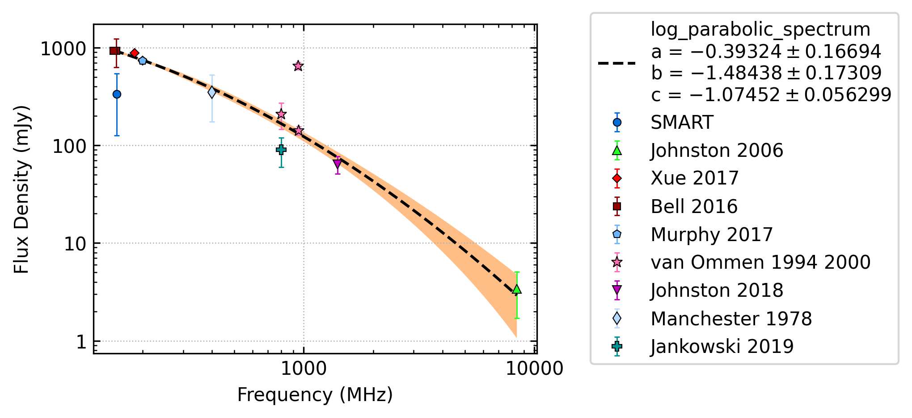
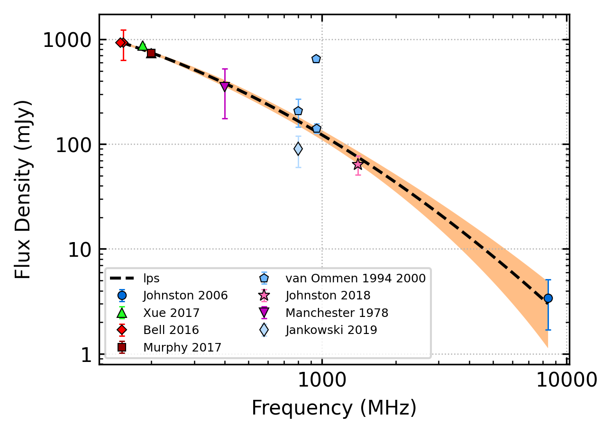
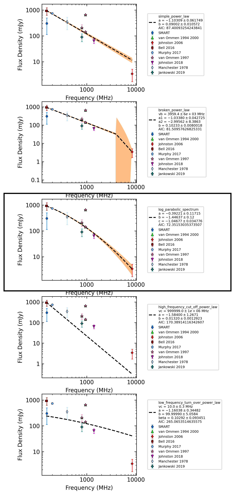
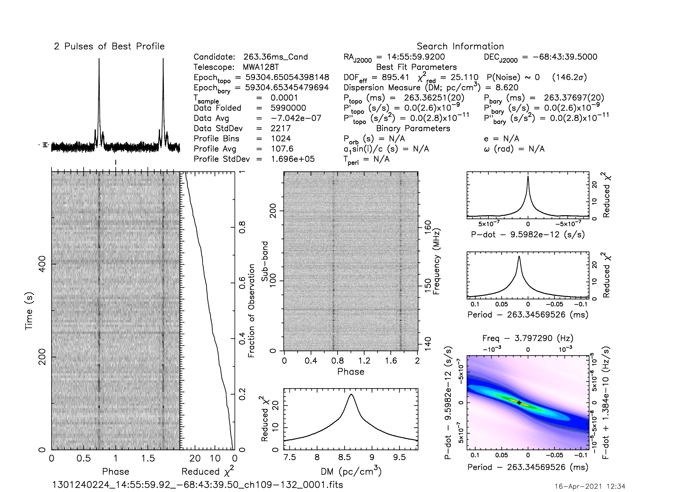
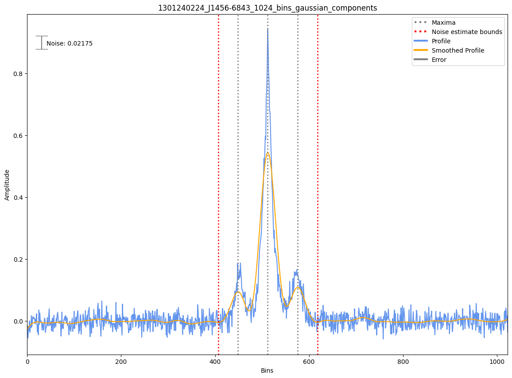
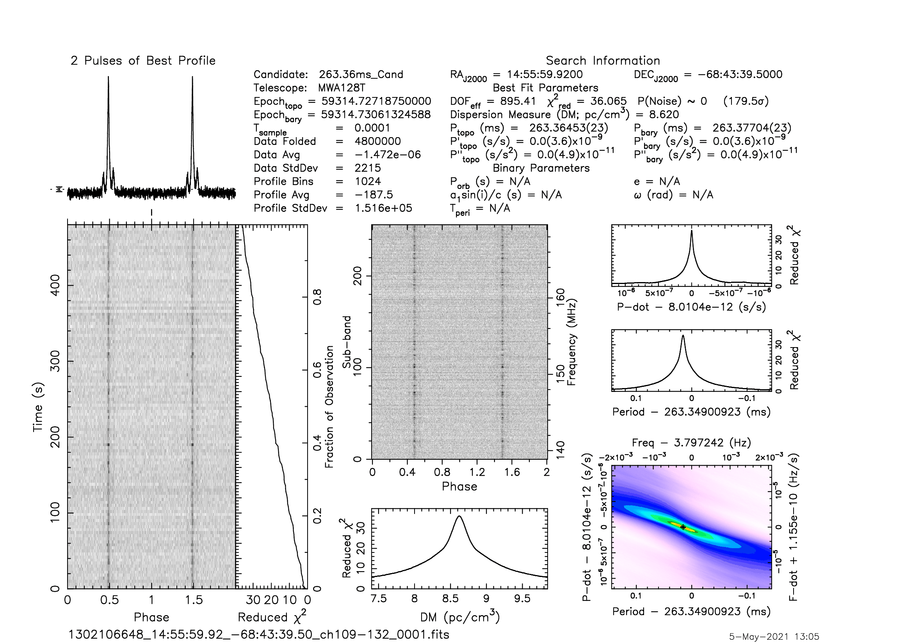
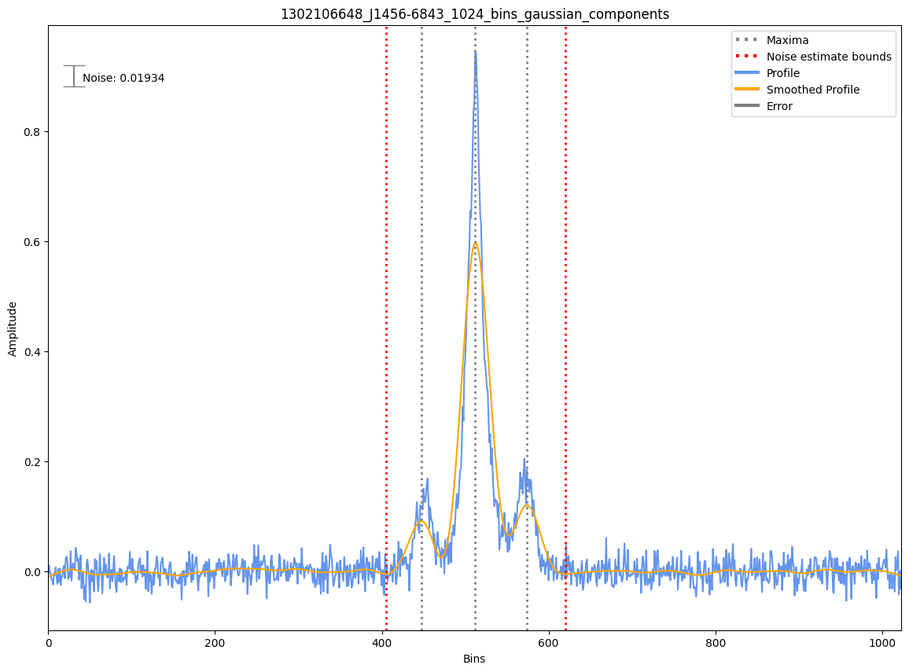

.. _J1456-6843:
J1456-6843
==========

Best Fit
--------

.. csv-table:: J1456-6843 fit results
   :header: "model","a","b","c","v0 (MHz)"

   "log_parabolic_spectrum","-0.39±0.17","-1.43±0.15","-0.98±0.05","1122±11"

Fit Before MWA
--------------

.. csv-table:: J1456-6843 before fit results
   :header: "model","a","b","c","v0 (MHz)"

   "log_parabolic_spectrum","-0.38±0.16","-1.43±0.15","-0.98±0.05","1122±11"

Flux Density Results
--------------------
.. csv-table:: J1456-6843 flux density total results
   :header: "N obs", "Flux Density (mJy)", "u_S_mean", "u_scint", "m_r_v"

   "2",  "334.5±209.0", "40.9", "308.0", "0.921"

.. csv-table:: J1456-6843 flux density individual results
   :header: "ObsID", "Flux Density (mJy)"

    "1301240224", "236.5±20.1"
    "1302106648", "432.5±35.6"

Comparison Fit
--------------

Detection Plots
---------------

