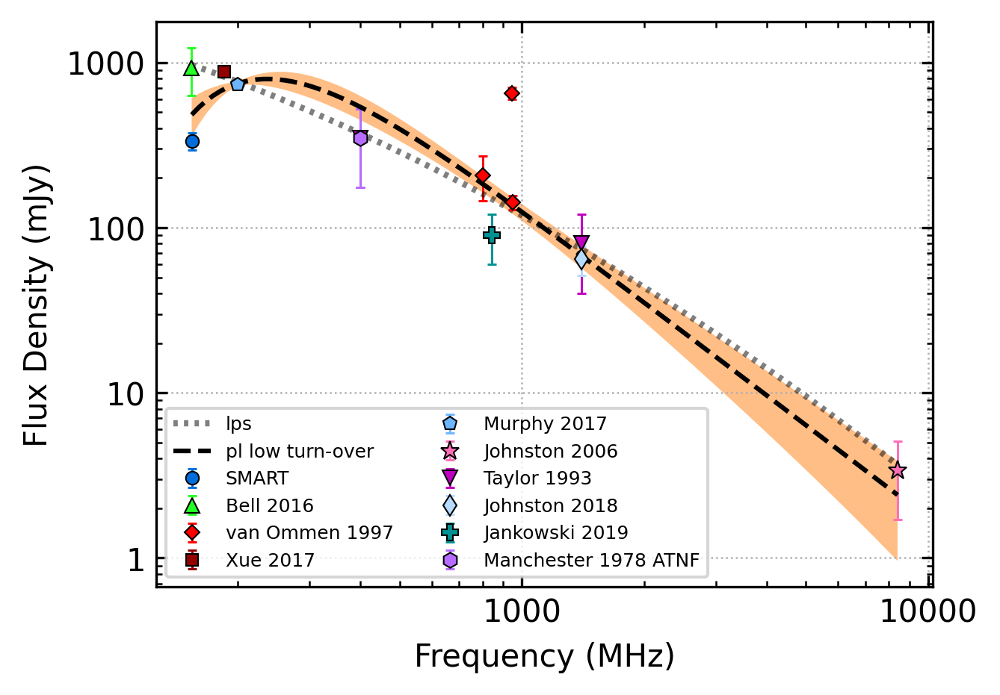

.. _J1456-6843:
J1456-6843
==========

Best Fit
--------

.. csv-table:: J1456-6843 fit results
   :header: "model","a","b","c","v0 (MHz)"

   "log_parabolic_spectrum","-0.33±0.22","-1.41±0.16","-1.00±0.05","1137±11"

Fit Before MWA
--------------

.. csv-table:: J1456-6843 before fit results
   :header: "model","a","b","c","v0 (MHz)"

   "log_parabolic_spectrum","-0.30±0.20","-1.39±0.14","-1.00±0.06","1137±11"

Flux Density Results
--------------------
.. csv-table:: J1456-6843 flux density total results
   :header: "N obs", "Flux Density (mJy)", "u_S_mean", "u_scint", "m_r_v"

   "2",  "334.5±209.0", "40.9", "308.0", "0.921"

.. csv-table:: J1456-6843 flux density individual results
   :header: "ObsID", "Flux Density (mJy)"

    "1301240224", "236.5±20.1"
    "1302106648", "432.5±35.6"

Comparison Fit
--------------
.. image:: comparison_fits/J1456-6843_comparison_fit.png
  :width: 800

Detection Plots
---------------

.. image:: detection_plots/pf_1301240224_J1456-6843_14:55:59.92_-68:43:39.50_b1024_263.36ms_Cand.pfd.png
  :width: 800

.. image:: on_pulse_plots/1301240224_J1456-6843_1024_bins_gaussian_components.png
  :width: 800
.. image:: detection_plots/pf_1302106648_J1456-6843_14:55:59.92_-68:43:39.50_b1024_263.36ms_Cand.pfd.png
  :width: 800

.. image:: on_pulse_plots/1302106648_J1456-6843_1024_bins_gaussian_components.png
  :width: 800