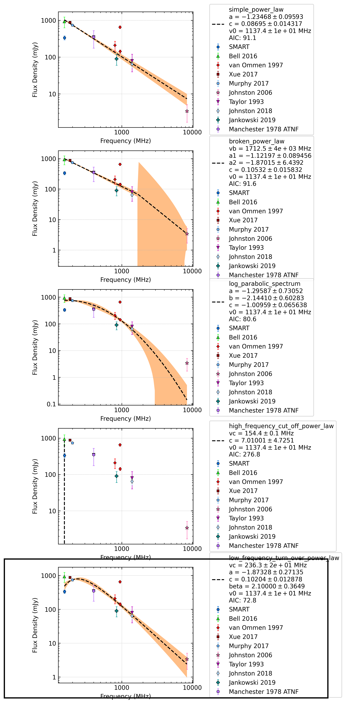

.. _J1456-6843:
J1456-6843
==========

Best Fit
--------
.. image:: best_fits/J1456-6843_log_parabolic_spectrum_fit.png
  :width: 800

.. csv-table:: J1456-6843 fit results
   :header: "model","a","b","c"

   "log_parabolic_spectrum","-0.39±0.12","-1.45±0.12","-1.05±0.03"

Fit Before MWA
--------------
.. image:: before_mwa/J1456-6843_log_parabolic_spectrum_fit.png
  :width: 800

.. csv-table:: J1456-6843 before fit results
   :header: "model","a","b","c"

   "log_parabolic_spectrum","-0.39±0.11","-1.44±0.12","-1.05±0.03"

Flux Density Results
--------------------
.. csv-table:: J1456-6843 flux density total results
   :header: "N obs", "Flux Density (mJy)", "u_S_mean", "u_scint", "m_r_v"

   "2",  "305.0±191.8", "37.5", "280.9", "0.921"

.. csv-table:: J1456-6843 flux density individual results
   :header: "ObsID", "Flux Density (mJy)"

    "1301240224", "209.7±17.8"
    "1302106648", "400.3±33.0"

Comparison Fit
--------------

Detection Plots
---------------

.. image:: on_pulse_plots/1301240224_J1456-6843_1024_bins_gaussian_components.png
  :width: 800
.. image:: detection_plots/pf_1302106648_J1456-6843_14:55:59.92_-68:43:39.50_b1024_263.36ms_Cand.pfd.png
  :width: 800

.. image:: on_pulse_plots/1302106648_J1456-6843_1024_bins_gaussian_components.png
  :width: 800