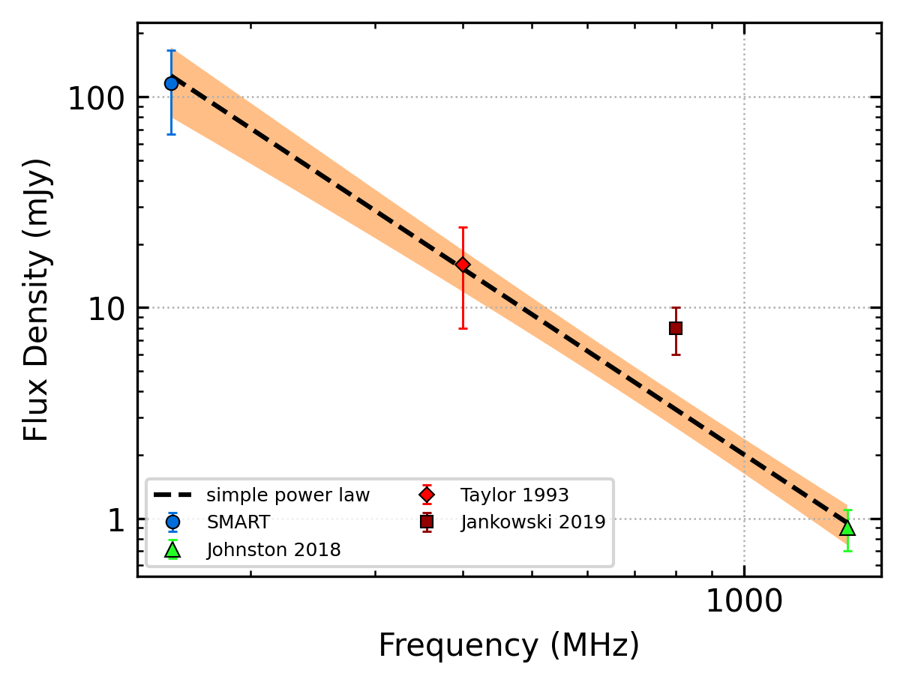
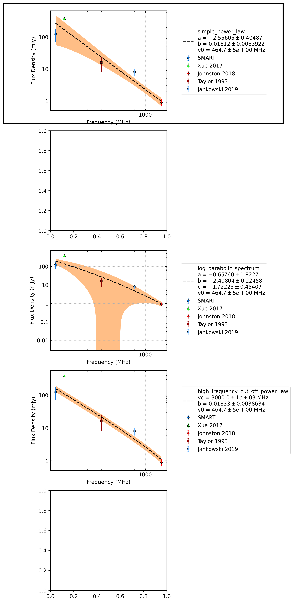

J1507-4352
==========

Best Fit
--------

.. csv-table:: J1507-4352 fit results
   :header: "model","a","b"

   "simple_power_law","-2.21±0.20","0.00±0.00"

Flux Density Results
--------------------
.. csv-table:: J1507-4352 flux density total results
   :header: "N obs", "Flux Density (mJy)", "u_S_mean", "u_scint", "m_r_v"

   "1",  "116.3±49.6", "14.7", "47.4", "0.408"

.. csv-table:: J1507-4352 flux density individual results
   :header: "ObsID", "Flux Density (mJy)"

    "1302282040", "116.3±14.7"

Comparison Fit
--------------

Detection Plots
---------------

.. image:: detection_plots/pf_1302282040_J1507-4352_15:07:34.17_-43:52:04.05_b1024_286.74ms_Cand.pfd.png
  :width: 800

.. image:: on_pulse_plots/1302282040_J1507-4352_1024_bins_gaussian_components.png
  :width: 800