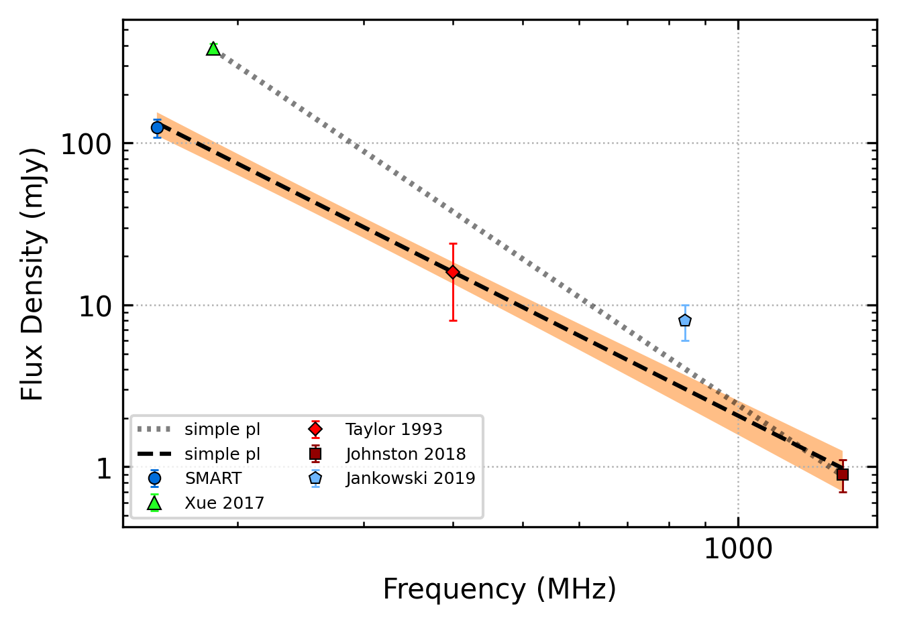
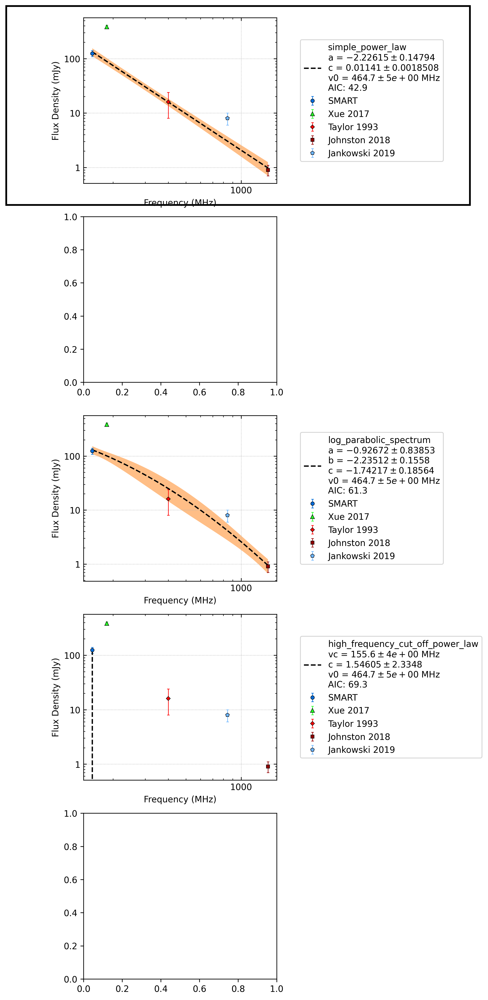

.. _J1507-4352:
J1507-4352
==========

Best Fit
--------

.. csv-table:: J1507-4352 fit results
   :header: "model","a","b","v0 (MHz)"

   "simple_power_law","-2.56±0.40","0.02±0.01","464±4"

Fit Before MWA
--------------

.. csv-table:: J1507-4352 before fit results
   :header: "model","a","b","v0 (MHz)"

   "simple_power_law","-2.99±0.17","0.02±0.00","508±5"

Flux Density Results
--------------------
.. csv-table:: J1507-4352 flux density total results
   :header: "N obs", "Flux Density (mJy)", "u_S_mean", "u_scint", "m_r_v"

   "1",  "124.5±53.1", "15.7", "50.8", "0.408"

.. csv-table:: J1507-4352 flux density individual results
   :header: "ObsID", "Flux Density (mJy)"

    "1302282040", "124.5±15.7"

Comparison Fit
--------------

Detection Plots
---------------

.. image:: detection_plots/pf_1302282040_J1507-4352_15:07:34.17_-43:52:04.05_b1024_286.74ms_Cand.pfd.png
  :width: 800

.. image:: on_pulse_plots/1302282040_J1507-4352_1024_bins_gaussian_components.png
  :width: 800