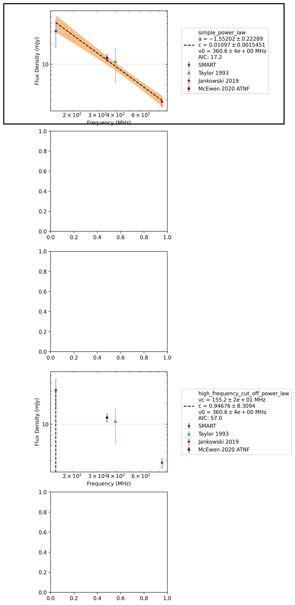

.. _J1527-3931:
J1527-3931
==========

Best Fit
--------

.. csv-table:: J1527-3931 fit results
   :header: "model","a","b","v0 (MHz)"

   "simple_power_law","-1.67±0.25","0.01±0.00","351±3"

Flux Density Results
--------------------
.. csv-table:: J1527-3931 flux density total results
   :header: "N obs", "Flux Density (mJy)", "u_S_mean", "u_scint", "m_r_v"

   "1",  "30.7±17.8", "12.7", "12.5", "0.408"

.. csv-table:: J1527-3931 flux density individual results
   :header: "ObsID", "Flux Density (mJy)"

    "1302282040", "30.7±12.7"

Comparison Fit
--------------

Detection Plots
---------------

.. image:: detection_plots/pf_1302282040_J1527-3931_15:27:58.82_-39:31:34.20_b100_2417.61ms_Cand.pfd.png
  :width: 800

.. image:: on_pulse_plots/1302282040_J1527-3931_100_bins_gaussian_components.png
  :width: 800