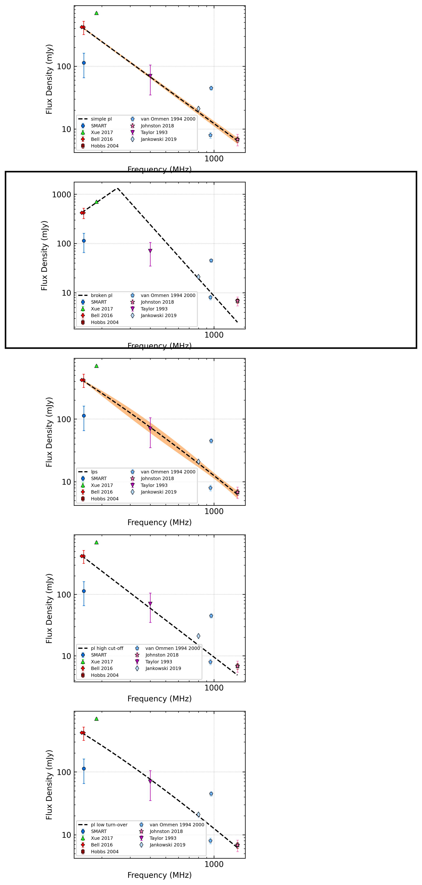
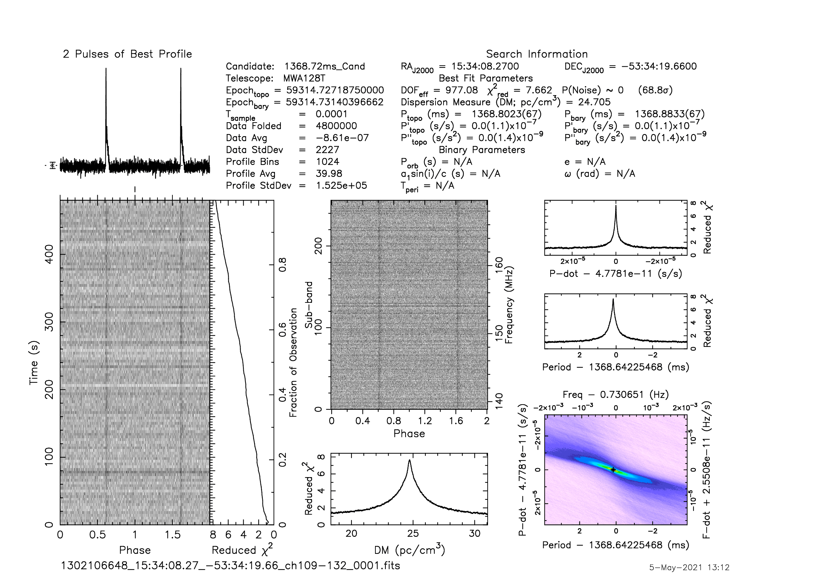
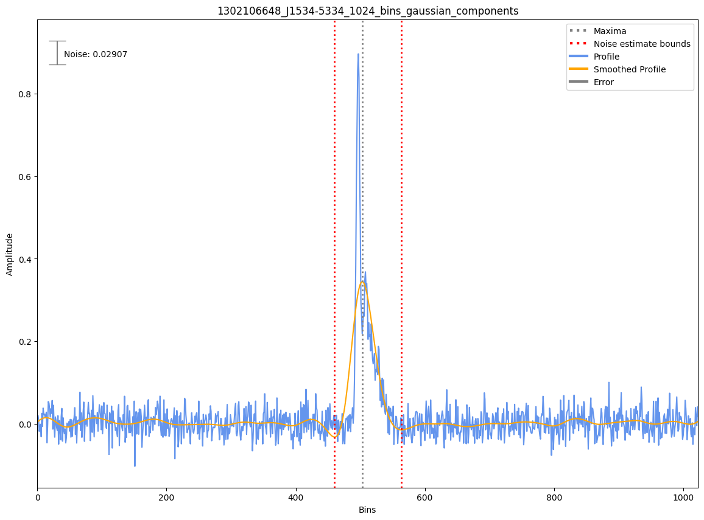

.. _J1534-5334:
J1534-5334
==========

Best Fit
--------
.. image:: best_fits/J1534-5334_fit.png
  :width: 800

.. csv-table:: J1534-5334 fit results
   :header: "model","vc (MHz)","a","b","beta","v0 (MHz)"

   "low_frequency_turn_over_power_law","207±3","-4.05±0.19","0.20±0.02","2.10±0.29","458±4"

Fit Before MWA
--------------

.. csv-table:: J1534-5334 before fit results
   :header: "model","vc (MHz)","a","b","beta","v0 (MHz)"

   "low_frequency_turn_over_power_law","206±3","-4.04±0.19","0.20±0.02","2.10±0.28","458±4"

Flux Density Results
--------------------
.. csv-table:: J1534-5334 flux density total results
   :header: "N obs", "Flux Density (mJy)", "u_S_mean", "u_scint", "m_r_v"

   "2",  "113.4±47.9", "23.1", "63.5", "0.560"

.. csv-table:: J1534-5334 flux density individual results
   :header: "ObsID", "Flux Density (mJy)"

    "1302106648", "132.0±16.2"
    "1302282040", "94.9±16.5"

Comparison Fit
--------------

Detection Plots
---------------

.. image:: detection_plots/pf_1302282040_J1534-5334_15:34:08.27_-53:34:19.66_b512_1368.73ms_Cand.pfd.png
  :width: 800

.. image:: on_pulse_plots/1302282040_J1534-5334_512_bins_gaussian_components.png
  :width: 800