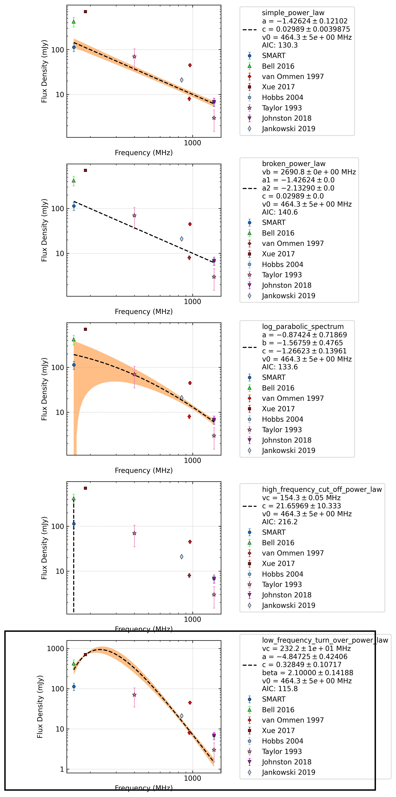

.. _J1534-5334:
J1534-5334
==========

Best Fit
--------
.. image:: best_fits/J1534-5334_broken_power_law_fit.png
  :width: 800

.. csv-table:: J1534-5334 fit results
   :header: "model","vb (MHz)","a1","a2","b"

   "broken_power_law","250±5","2.25±0.24","-3.65±0.17","54.93±27.03"

Fit Before MWA
--------------
.. image:: before_mwa/J1534-5334_broken_power_law_fit.png
  :width: 800

.. csv-table:: J1534-5334 before fit results
   :header: "model","vb (MHz)","a1","a2","b"

   "broken_power_law","250±5","2.24±0.22","-3.65±0.17","53.84±25.29"

Flux Density Results
--------------------
.. csv-table:: J1534-5334 flux density total results
   :header: "N obs", "Flux Density (mJy)", "u_S_mean", "u_scint", "m_r_v"

   "2",  "113.4±47.9", "23.1", "63.5", "0.560"

.. csv-table:: J1534-5334 flux density individual results
   :header: "ObsID", "Flux Density (mJy)"

    "1302106648", "132.0±16.2"
    "1302282040", "94.9±16.5"

Comparison Fit
--------------

Detection Plots
---------------

.. image:: on_pulse_plots/1302106648_J1534-5334_1024_bins_gaussian_components.png
  :width: 800
.. image:: detection_plots/pf_1302282040_J1534-5334_15:34:08.27_-53:34:19.66_b512_1368.73ms_Cand.pfd.png
  :width: 800

.. image:: on_pulse_plots/1302282040_J1534-5334_512_bins_gaussian_components.png
  :width: 800