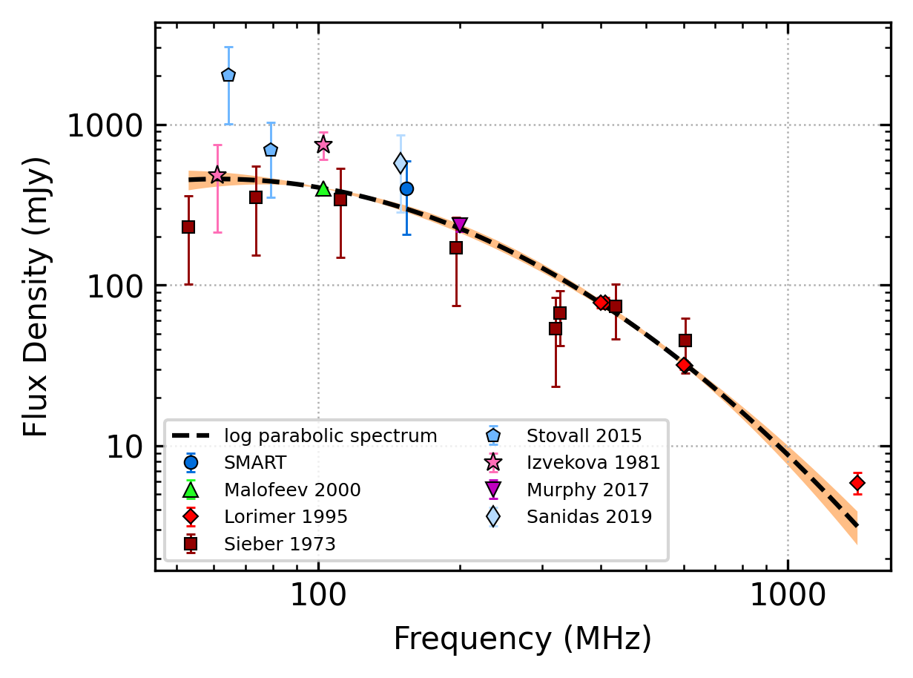
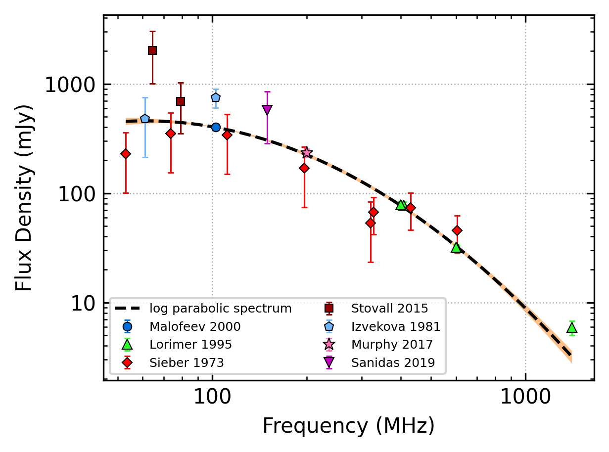

.. _J1543+0929:
J1543+0929
==========

Best Fit
--------

.. csv-table:: J1543+0929 fit results
   :header: "model","a","b","c"

   "log_parabolic_spectrum","-1.17±0.21","-3.10±0.31","-2.39±0.09"

Fit Before MWA
--------------

.. csv-table:: J1543+0929 before fit results
   :header: "model","a","b","c"

   "log_parabolic_spectrum","-1.16±0.27","-3.09±0.40","-2.39±0.12"

Flux Density Results
--------------------
.. csv-table:: J1543+0929 flux density total results
   :header: "N obs", "Flux Density (mJy)", "u_S_mean", "u_scint", "m_r_v"

   "1",  "397.7±191.3", "26.0", "189.5", "0.477"

.. csv-table:: J1543+0929 flux density individual results
   :header: "ObsID", "Flux Density (mJy)"

    "1302540536", "397.7±26.0"

Comparison Fit
--------------
.. image:: comparison_fits/J1543+0929_comparison_fit.png
  :width: 800

Detection Plots
---------------

.. image:: detection_plots/pf_1302540536_J1543+0929_15:43:38.82_+09:29:16.33_b1024_748.40ms_Cand.pfd.png
  :width: 800

.. image:: on_pulse_plots/1302540536_J1543+0929_1024_bins_gaussian_components.png
  :width: 800