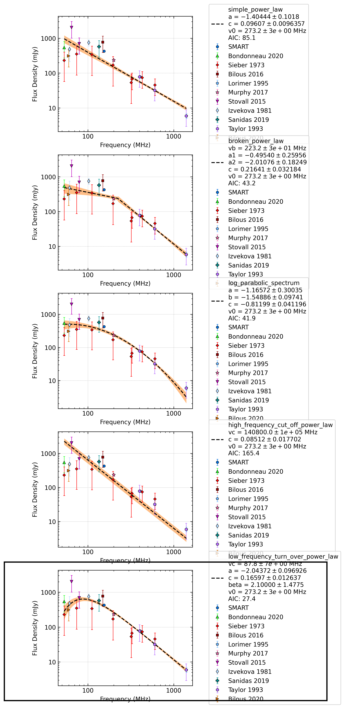

.. _J1543+0929:
J1543+0929
==========

Best Fit
--------
.. image:: best_fits/J1543+0929_low_frequency_turn_over_power_law_fit.png
  :width: 800

.. csv-table:: J1543+0929 fit results
   :header: "model","vc (MHz)","a","b","beta","v0 (MHz)"

   "low_frequency_turn_over_power_law","89±16","-2.41±0.64","0.32±0.41","0.98±0.60","273±2"

Fit Before MWA
--------------
.. image:: before_mwa/J1543+0929_low_frequency_turn_over_power_law_fit.png
  :width: 800

.. csv-table:: J1543+0929 before fit results
   :header: "model","vc (MHz)","a","b","beta","v0 (MHz)"

   "low_frequency_turn_over_power_law","89±16","-2.41±0.64","0.33±0.42","0.97±0.60","273±2"

Flux Density Results
--------------------
.. csv-table:: J1543+0929 flux density total results
   :header: "N obs", "Flux Density (mJy)", "u_S_mean", "u_scint", "m_r_v"

   "1",  "426.2±205.0", "27.8", "203.1", "0.477"

.. csv-table:: J1543+0929 flux density individual results
   :header: "ObsID", "Flux Density (mJy)"

    "1302540536", "426.2±27.8"

Comparison Fit
--------------

Detection Plots
---------------

.. image:: on_pulse_plots/1302540536_J1543+0929_1024_bins_gaussian_components.png
  :width: 800