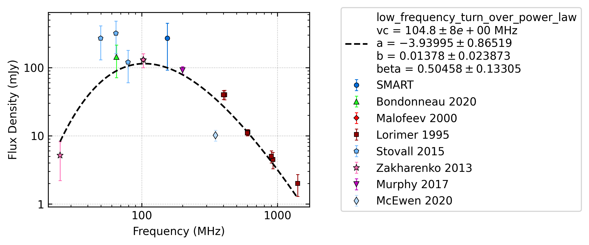
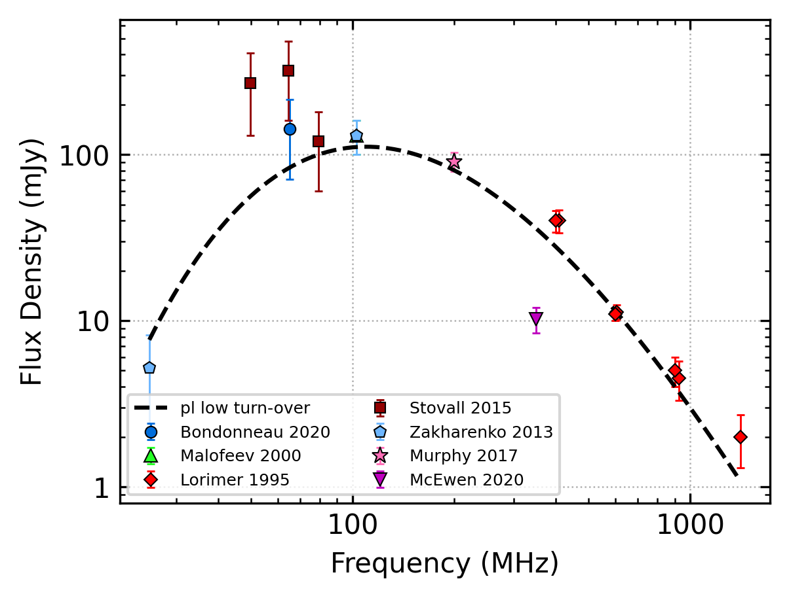
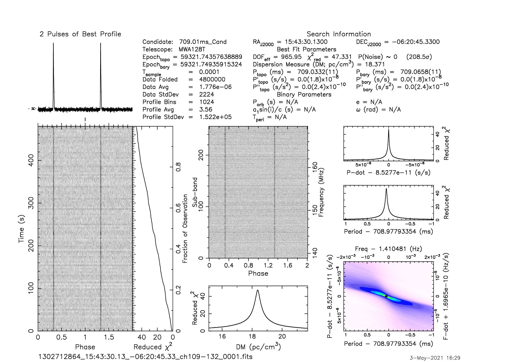
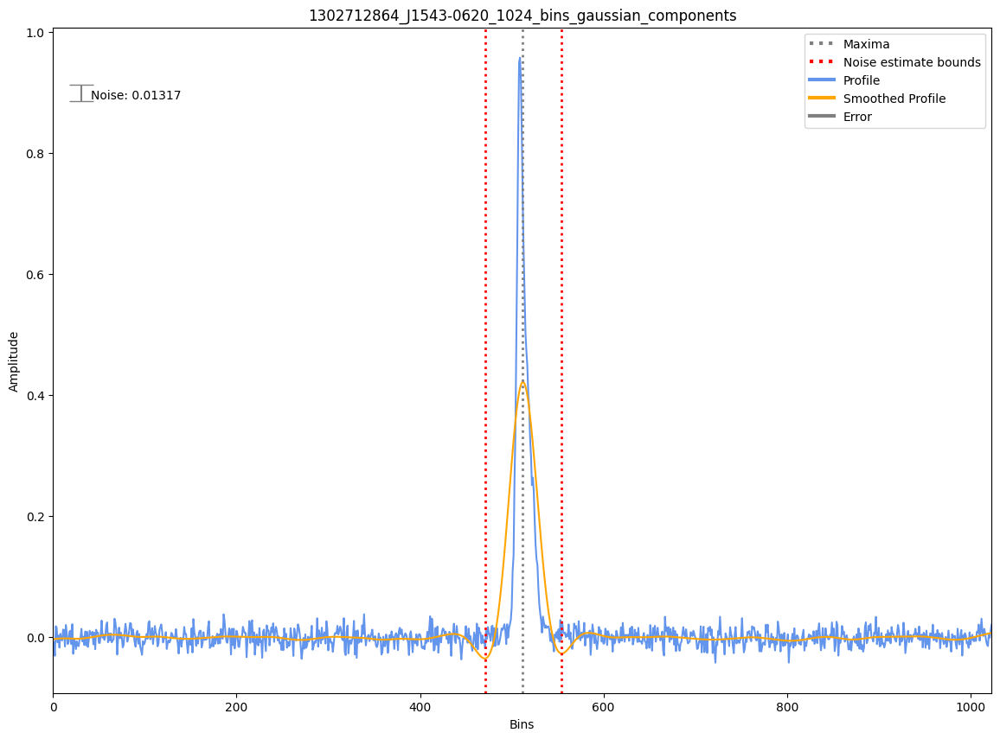

.. _J1543-0620:
J1543-0620
==========

Best Fit
--------

.. csv-table:: J1543-0620 fit results
   :header: "model","vc (MHz)","a","b","beta"

   "low_frequency_turn_over_power_law","104±8","-3.94±0.87","0.01±0.02","0.50±0.13"

Fit Before MWA
--------------

.. csv-table:: J1543-0620 before fit results
   :header: "model","vc (MHz)","a","b","beta"

   "low_frequency_turn_over_power_law","109±7","-4.72±0.53","0.08±0.08","0.42±0.03"

Flux Density Results
--------------------
.. csv-table:: J1543-0620 flux density total results
   :header: "N obs", "Flux Density (mJy)", "u_S_mean", "u_scint", "m_r_v"

   "1",  "269.5±177.6", "34.9", "174.1", "0.646"

.. csv-table:: J1543-0620 flux density individual results
   :header: "ObsID", "Flux Density (mJy)"

    "1302712864", "269.5±34.9"

Comparison Fit
--------------
.. image:: comparison_fits/J1543-0620_comparison_fit.png
  :width: 800

Detection Plots
---------------

