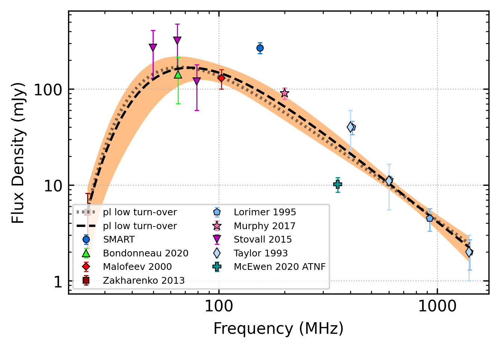
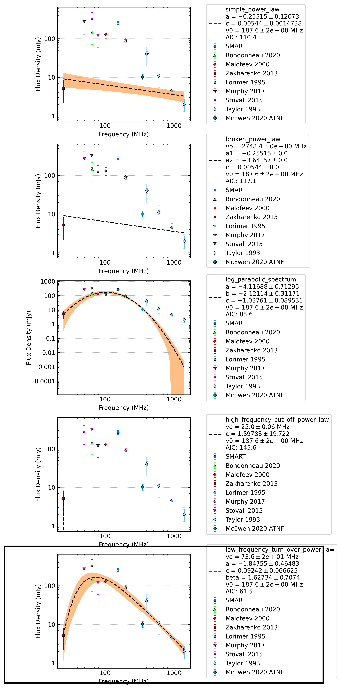

.. _J1543-0620:
J1543-0620
==========

Best Fit
--------

.. csv-table:: J1543-0620 fit results
   :header: "model","vc (MHz)","a","b","beta","v0 (MHz)"

   "low_frequency_turn_over_power_law","75±17","-1.84±0.49","0.10±0.07","1.54±0.70","187±1"

Fit Before MWA
--------------

.. csv-table:: J1543-0620 before fit results
   :header: "model","vc (MHz)","a","b","beta","v0 (MHz)"

   "low_frequency_turn_over_power_law","75±18","-1.82±0.48","0.09±0.07","1.57±0.72","187±1"

Flux Density Results
--------------------
.. csv-table:: J1543-0620 flux density total results
   :header: "N obs", "Flux Density (mJy)", "u_S_mean", "u_scint", "m_r_v"

   "1",  "269.5±177.6", "34.9", "174.1", "0.646"

.. csv-table:: J1543-0620 flux density individual results
   :header: "ObsID", "Flux Density (mJy)"

    "1302712864", "269.5±34.9"

Comparison Fit
--------------

Detection Plots
---------------

.. image:: detection_plots/pf_1302712864_J1543-0620_15:43:30.13_-06:20:45.33_b1024_709.01ms_Cand.pfd.png
  :width: 800

.. image:: on_pulse_plots/1302712864_J1543-0620_1024_bins_gaussian_components.png
  :width: 800