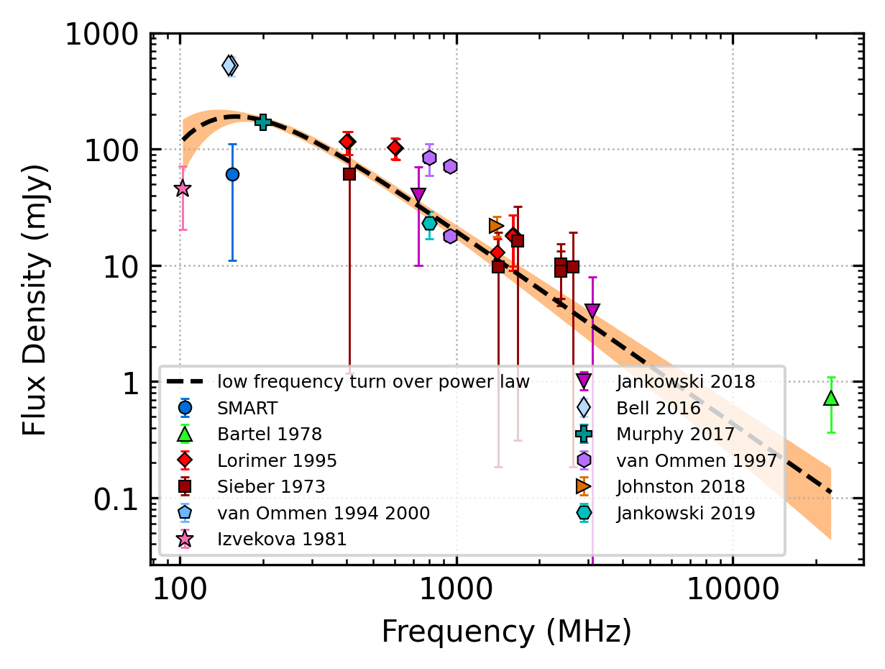
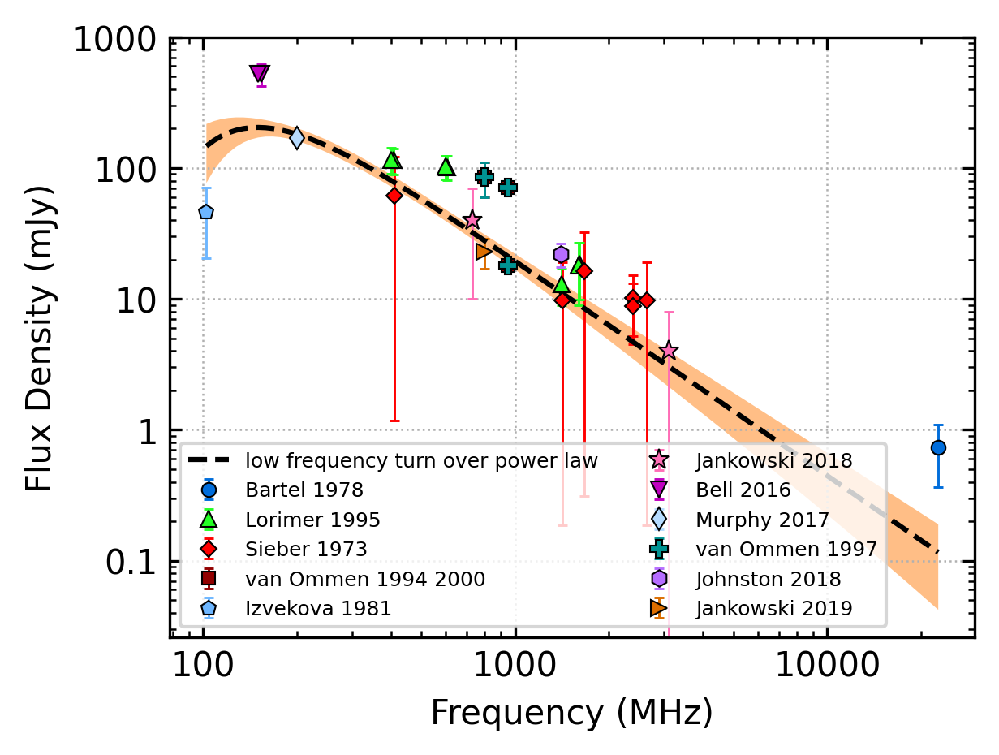

.. _J2048-1616:
J2048-1616
==========

Best Fit
--------

.. csv-table:: J2048-1616 fit results
   :header: "model","vc (MHz)","a","b","beta"

   "low_frequency_turn_over_power_law","158±23","-1.66±0.17","0.01±0.00","2.10±0.29"

Fit Before MWA
--------------

.. csv-table:: J2048-1616 before fit results
   :header: "model","vc (MHz)","a","b","beta"

   "low_frequency_turn_over_power_law","149±24","-1.64±0.17","0.01±0.00","2.10±0.27"

Flux Density Results
--------------------
.. csv-table:: J2048-1616 flux density total results
   :header: "N obs", "Flux Density (mJy)", "u_S_mean", "u_scint", "m_r_v"

   "1",  "60.9±49.8", "8.8", "49.1", "0.805"

.. csv-table:: J2048-1616 flux density individual results
   :header: "ObsID", "Flux Density (mJy)"

    "1222435400", "60.9±8.8"

Comparison Fit
--------------
.. image:: comparison_fits/J2048-1616_comparison_fit.png
  :width: 800

Detection Plots
---------------

.. image:: detection_plots/pf_1222435400_J2048-1616_20:48:35.64_-16:16:44.55_b512_1961.61ms_Cand.pfd.png
  :width: 800

.. image:: on_pulse_plots/1222435400_J2048-1616_512_bins_gaussian_components.png
  :width: 800