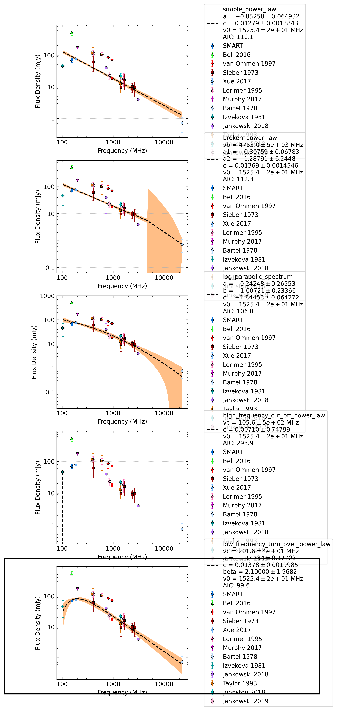

.. _J2048-1616:
J2048-1616
==========

Best Fit
--------
.. image:: best_fits/J2048-1616_broken_power_law_fit.png
  :width: 800

.. csv-table:: J2048-1616 fit results
   :header: "model","vb (MHz)","a1","a2","b"

   "broken_power_law","237±43","1.43±0.81","-1.51±0.41","2.37±2.96"

Fit Before MWA
--------------
.. image:: before_mwa/J2048-1616_broken_power_law_fit.png
  :width: 800

.. csv-table:: J2048-1616 before fit results
   :header: "model","vb (MHz)","a1","a2","b"

   "broken_power_law","239±46","1.28±0.74","-1.51±0.41","1.82±2.22"

Flux Density Results
--------------------
.. csv-table:: J2048-1616 flux density total results
   :header: "N obs", "Flux Density (mJy)", "u_S_mean", "u_scint", "m_r_v"

   "1",  "69.2±56.6", "9.9", "55.7", "0.805"

.. csv-table:: J2048-1616 flux density individual results
   :header: "ObsID", "Flux Density (mJy)"

    "1222435400", "69.2±9.9"

Comparison Fit
--------------

Detection Plots
---------------

.. image:: on_pulse_plots/1222435400_J2048-1616_512_bins_gaussian_components.png
  :width: 800