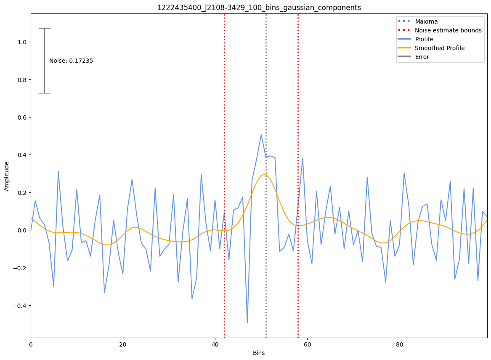

J2108-3429
==========

Best Fit
--------
.. image:: best_fits/J2108-3429_simple_power_law_fit.png
  :width: 800

.. csv-table:: J2108-3429 fit results
   :header: "model","a","b"

   "simple_power_law","-1.13±0.19","0.00±0.00"

Fit Before MWA
--------------
.. image:: before_mwa/J2108-3429_simple_power_law_fit.png
  :width: 800

.. csv-table:: J2108-3429 before fit results
   :header: "model","a","b"

   "simple_power_law","-1.11±0.19","0.00±0.00"

Flux Density Results
--------------------
.. csv-table:: J2108-3429 flux density total results
   :header: "N obs", "Flux Density (mJy)", "u_S_mean", "u_scint", "m_r_v"

   "1",  "11.1±7.3", "4.6", "5.7", "0.510"

.. csv-table:: J2108-3429 flux density individual results
   :header: "ObsID", "Flux Density (mJy)"

    "1222435400", "11.1±4.6"

Comparison Fit
--------------
.. image:: comparison_fits/J2108-3429_comparison_fit.png
  :width: 800

Detection Plots
---------------

.. image:: detection_plots/pf_1222435400_J2108-3429_21:08:30.49_-34:29:37.90_b100_1423.10ms_Cand.pfd.png
  :width: 800

