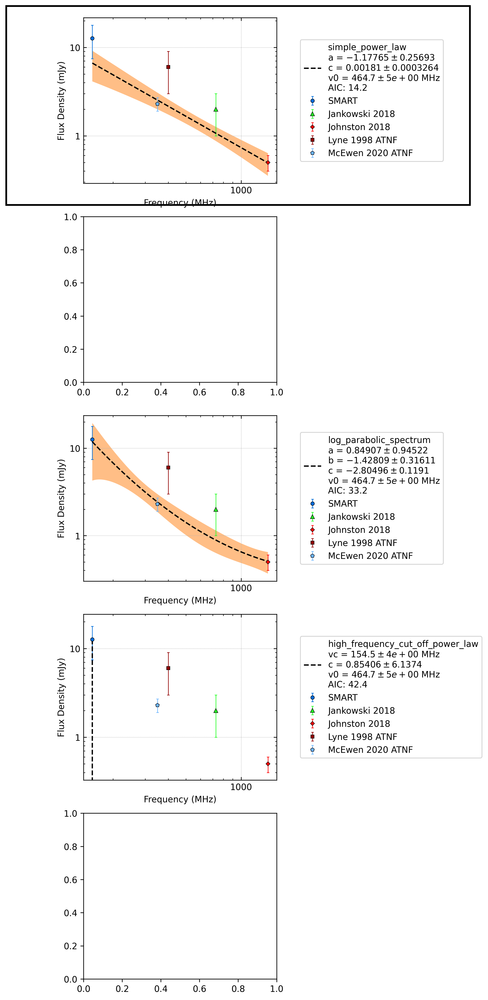

.. _J2108-3429:
J2108-3429
==========

Best Fit
--------

.. csv-table:: J2108-3429 fit results
   :header: "model","a","c","v0 (MHz)"

   "simple_power_law","-1.18±0.26","0.00±0.00","464±4"

Fit Before MWA
--------------

.. csv-table:: J2108-3429 before fit results
   :header: "model","a","c","v0 (MHz)"

   "simple_power_law","-1.11±0.26","0.00±0.00","700±7"

Flux Density Results
--------------------
.. csv-table:: J2108-3429 flux density total results
   :header: "N obs", "Flux Density (mJy)", "u_S_mean", "u_scint", "m_r_v"

   "1",  "12.6±8.3", "5.2", "6.4", "0.510"

.. csv-table:: J2108-3429 flux density individual results
   :header: "ObsID", "Flux Density (mJy)"

    "1222435400", "12.6±5.2"

Comparison Fit
--------------

Detection Plots
---------------

.. image:: on_pulse_plots/1222435400_J2108-3429_100_bins_gaussian_components.png
  :width: 800