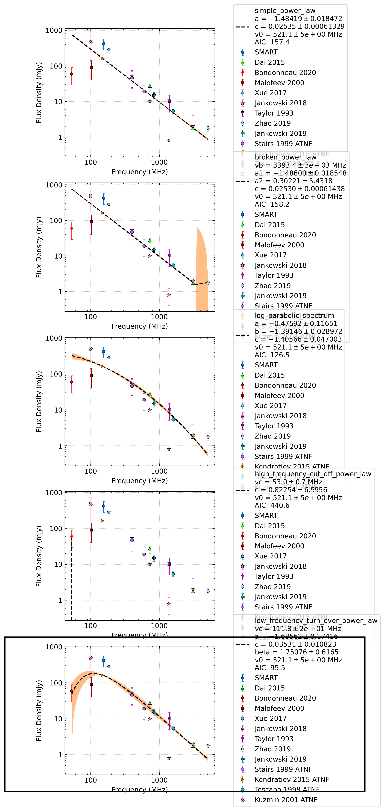

J2145-0750
==========

Best Fit
--------
.. image:: best_fits/J2145-0750_simple_power_law_fit.png
  :width: 800

.. csv-table:: J2145-0750 fit results
   :header: "model","a","b"

   "simple_power_law","-1.49±0.01","0.01±0.00"

Fit Before MWA
--------------
.. image:: before_mwa/J2145-0750_simple_power_law_fit.png
  :width: 800

.. csv-table:: J2145-0750 before fit results
   :header: "model","a","b"

   "simple_power_law","-1.49±0.01","0.01±0.00"

Flux Density Results
--------------------
.. csv-table:: J2145-0750 flux density total results
   :header: "N obs", "Flux Density (mJy)", " u_S_mean", "u_scint", "m_r_v"

   "2",  "368.2±318.2", "124.2", "332.1", "0.902"

.. csv-table:: J2145-0750 flux density individual results
   :header: "ObsID", "Flux Density (mJy)"

    "1221832280", "682.8±123.8"
    "1222697776", "53.6±9.7"

Comparison Fit
--------------

Detection Plots
---------------

.. image:: on_pulse_plots/1221832280_J2145-0750_100_bins_gaussian_components.png
  :width: 800
.. image:: detection_plots/pf_1222697776_J2145-0750_21:45:50.45_-07:50:18.51_b161_PSR_J2145-0750.pfd.png
  :width: 800

.. image:: on_pulse_plots/1222697776_J2145-0750_161_bins_gaussian_components.png
  :width: 800