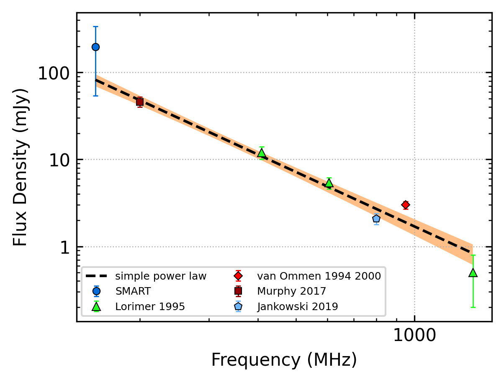
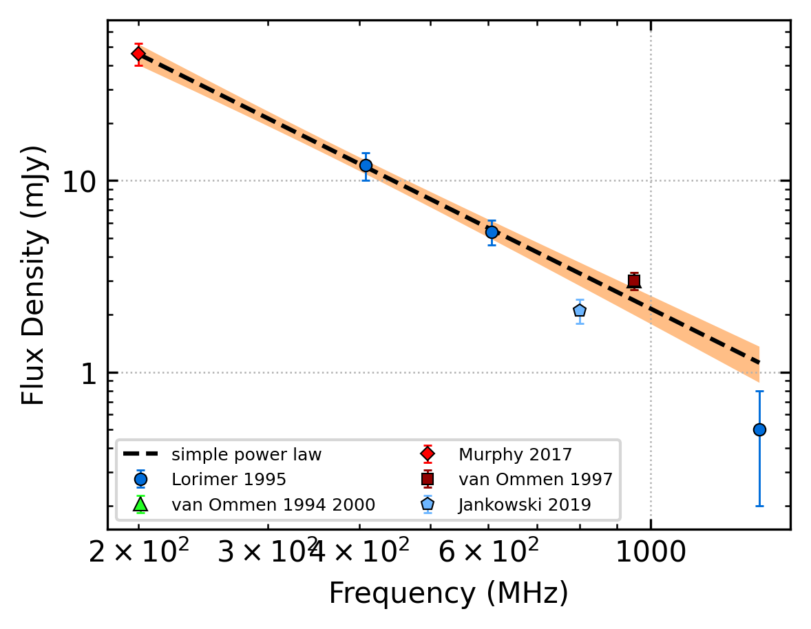

.. _J2155-3118:
J2155-3118
==========

Best Fit
--------

.. csv-table:: J2155-3118 fit results
   :header: "model","a","b"

   "simple_power_law","-2.23±0.08","0.00±0.00"

Fit Before MWA
--------------

.. csv-table:: J2155-3118 before fit results
   :header: "model","a","b"

   "simple_power_law","-2.22±0.08","0.00±0.00"

Flux Density Results
--------------------
.. csv-table:: J2155-3118 flux density total results
   :header: "N obs", "Flux Density (mJy)", "u_S_mean", "u_scint", "m_r_v"

   "1",  "222.8±161.3", "28.2", "158.8", "0.713"

.. csv-table:: J2155-3118 flux density individual results
   :header: "ObsID", "Flux Density (mJy)"

    "1222435400", "222.8±28.2"

Comparison Fit
--------------
.. image:: comparison_fits/J2155-3118_comparison_fit.png
  :width: 800

Detection Plots
---------------

.. image:: detection_plots/pf_1222435400_J2155-3118_21:55:13.61_-31:18:54.66_b1024_1030.04ms_Cand.pfd.png
  :width: 800

.. image:: on_pulse_plots/1222435400_J2155-3118_1024_bins_gaussian_components.png
  :width: 800